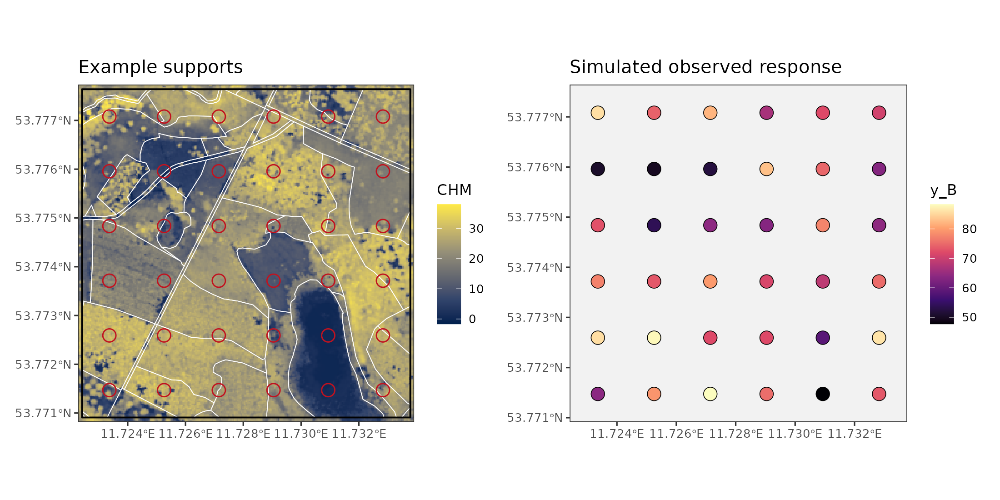
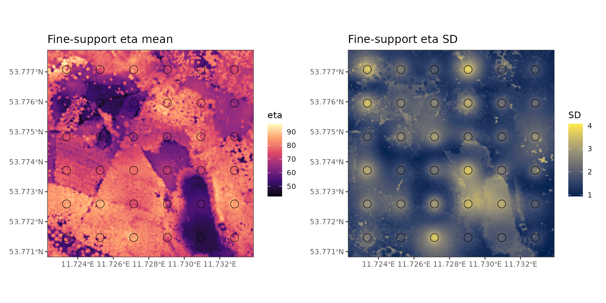

# cosTapered

`cosTapered` fits Bayesian change-of-support Gaussian process models for
forest inventory and remote-sensing problems where responses, predictors, and
prediction targets live on different spatial supports.

The motivating case is common in forest applications: LiDAR-derived predictors
are available on a fine raster grid, field responses are observed on larger
fixed-area plots, and final summaries are needed for irregular stands or other
management units. Rather than forcing everything onto one arbitrary support
before modeling, `cosTapered` defines a latent response surface on the fine
predictor grid and links plots and stands to that surface through
area-weighted averages.



Plots and stands are treated symmetrically: both are averages of the same
fine-scale process over their footprints. The package uses a tapered
exponential covariance for spatial residual variation so that large raster and
polygon-support problems remain computationally manageable.



## Features

- Prepare raster covariates and observed-support polygons with
  `cos_prepare()`.
- Fit a tapered change-of-support model with `cos_fit()`.
- Recover observed-support latent quantities with `cos_recover_B()`.
- Predict fine-support or areal-support targets with `cos_predict_fine()` and
  `cos_predict_areal()`.
- Choose latent or observed prediction targets with `target = "latent"` or
  `target = "observed"`.
- Run observed-support K-fold validation with `cos_cv_observed()`.

## Installation

```r
install.packages("remotes")
remotes::install_github("finleya/cosTapered", subdir = "cosTapered")
```

## Example

```r
library(cosTapered)
library(raster)
library(sf)

chm <- raster(system.file("extdata", "example_chm.tif",
                          package = "cosTapered"))
names(chm) <- "chm"

B_sf <- st_read(system.file("extdata", "example_B.gpkg",
                            package = "cosTapered"), quiet = TRUE)

intercept <- chm
intercept[] <- ifelse(is.na(getValues(chm)), NA_real_, 1)
names(intercept) <- "intercept"

X_rast <- stack(intercept, chm)
names(X_rast) <- c("intercept", "chm")

prep <- cos_prepare(
  X_rast = X_rast,
  B_sf = B_sf,
  response_col = "y_B",
  gamma = 350,
  n_threads = 1,
  verbose = FALSE
)

summary(prep)

truth <- readRDS(system.file("extdata", "example_truth.rds",
                             package = "cosTapered"))

priors <- cos_default_priors(
  prep = prep,
  beta_mu = c(intercept = 40, chm = 1),
  beta_sd = c(intercept = 20, chm = 2),
  tau_B_shape = 2,
  tau_B_scale = truth$tau_B_sq_true,
  sigma_shape = 2,
  sigma_scale = truth$sigma_sq_true,
  phi_lower = 3 / 600,
  phi_upper = 3 / 80
)

fit <- cos_fit(
  prep = prep,
  priors = priors,
  n_chains = 1,
  starting = c(
    tau_B_sq = truth$tau_B_sq_true,
    sigma_sq = truth$sigma_sq_true,
    phi = truth$phi_true
  ),
  tuning = c(log_tau_B_sq = 0.25, log_sigma_sq = 0.25, z_phi = 0.25),
  n_batch = 50,
  batch_length = 10,
  seed = 1,
  verbose = FALSE
)

summary(fit, burn_in = 25)
```

See the package vignette for a complete workflow:

```r
vignette("cosTapered-model", package = "cosTapered")
```

The vignette covers prior specification, MCMC fitting, observed-support
recovery, fine-support prediction, areal prediction, and cross-validation.

## Model Scope

The current package supports the standard tapered exponential covariance and a
proper normal prior for regression coefficients. Users supply the raster
design matrix they want the model to use; `cosTapered` does not automatically
add intercepts or scale covariates.

Prediction functions distinguish the latent process from the observed process.
For example, `target = "latent"` predicts \(\eta\), while
`target = "observed"` adds the appropriate support-level nugget variation.

## Package Source

The R package source is in `cosTapered/`.

## Reference

Zhang, L., Finley, A. O., Nothdurft, A., and Banerjee, S. (2024). Bayesian
modeling of incompatible spatial data: A case study involving Post-Adrian storm
forest damage assessment. *International Journal of Applied Earth Observation
and Geoinformation*, 135, 104224. <https://doi.org/10.1016/j.jag.2024.104224>
