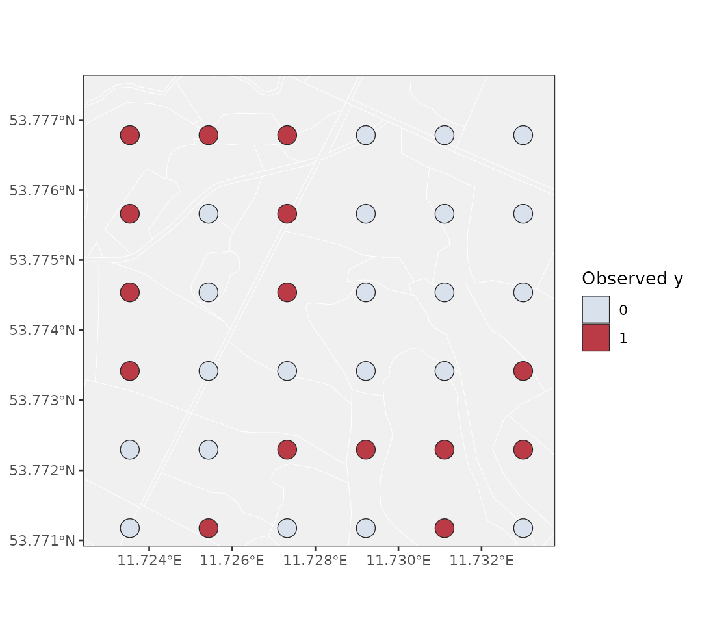
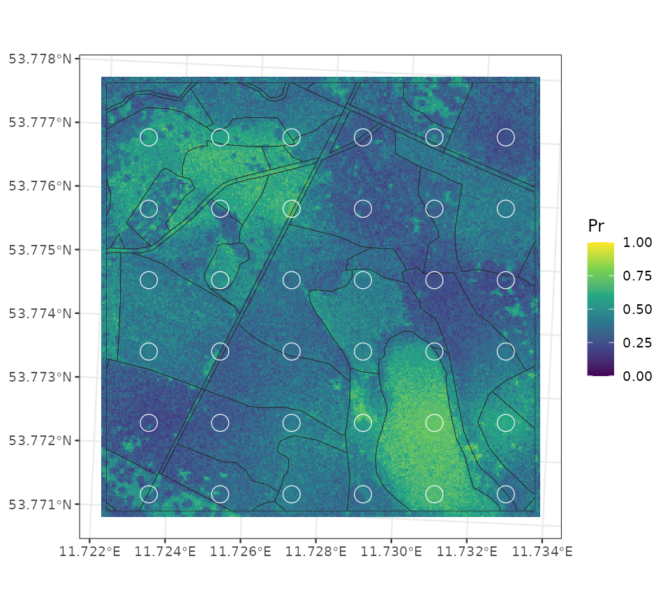
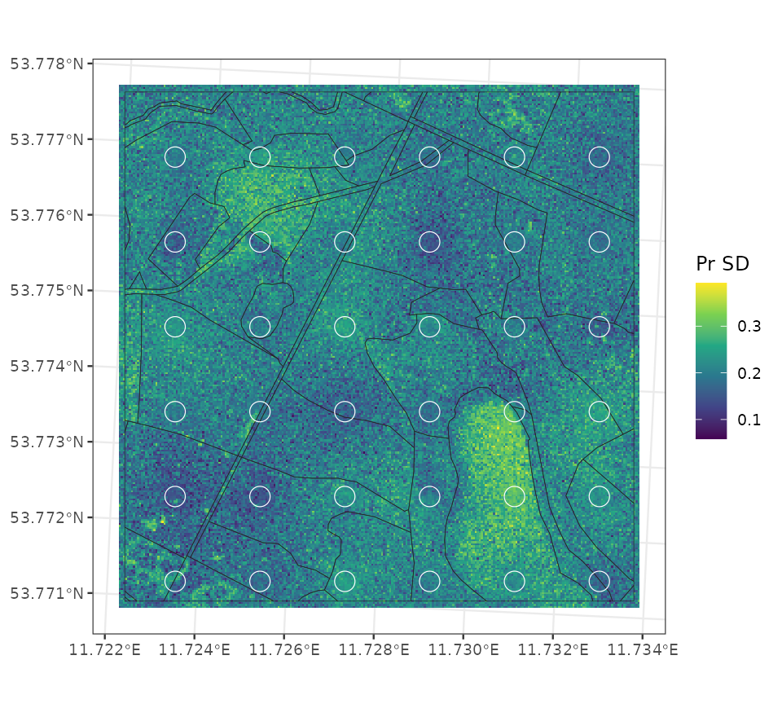
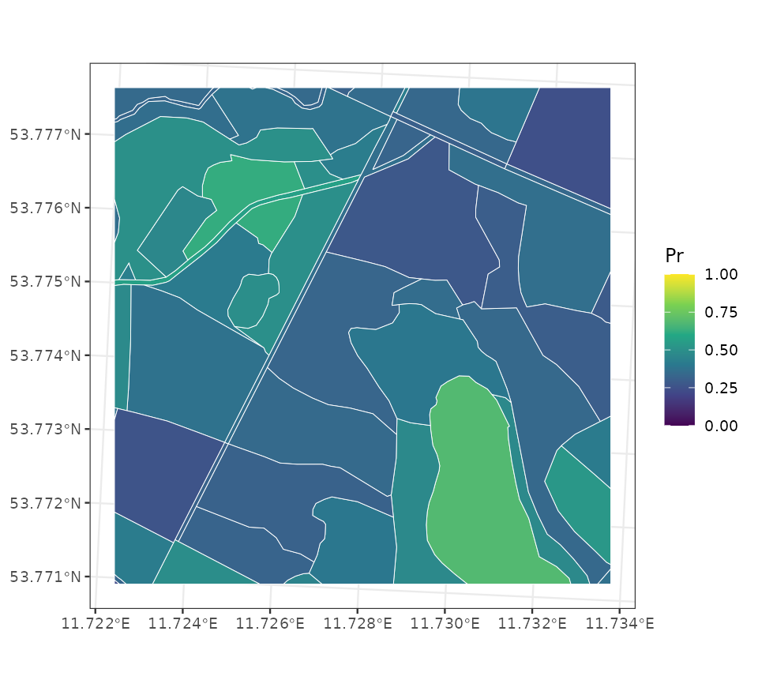
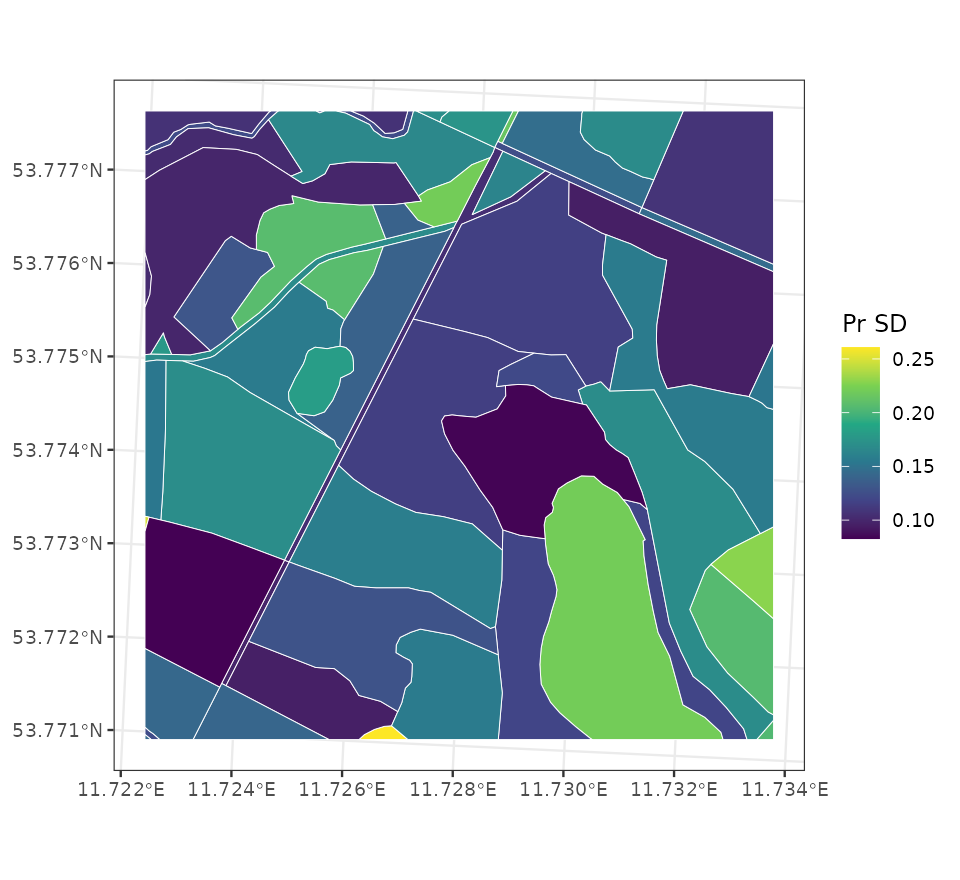

This vignette illustrates the experimental binomial response model in
`cosTapered`. The Gaussian COS model remains the default. The binomial path
uses Polya-Gamma augmentation and keeps `beta` and the observed-support spatial
effect `omega_B` explicit in the sampler state.

The example uses the package's bundled raster covariate and plot polygons. We
simulate binary plot outcomes from a weak fine-support covariate effect and a
stronger spatial Gaussian process, fit the binomial COS model, and summarize
predicted response probability over the fine grid.

The simulation, fitting, and prediction chunks are displayed without execution
so that vignette builds stay quick. Run them in order to reproduce the model
workflow. The figures and distance summaries are saved from an earlier example
run; they are not regenerated during a vignette build. The short chain and 12
retained draws demonstrate the API; use longer chains, more draws, and
convergence diagnostics for inference.

## Model

For observed support $B_l$, the first binomial implementation uses

$$
z_l \mid \eta_l, m_l
\sim \mathrm{Binomial}\{m_l, \mathrm{logit}^{-1}(\eta_l)\},
\qquad
\eta_l = \mathbf{x}_B(B_l)^\top \beta + \omega_B(B_l),
$$

where $z_l$ is the number of successes out of $m_l$ trials and
$\mathbf{x}_B(B_l)^\top$ is row $l$ of the observed-support design matrix
$X_B = H_{BA}X$ from `cos_prepare()`. The spatial effect $\omega_B$ has the
same tapered observed-support Gaussian process prior used by the Gaussian COS
model. Conditional on Polya-Gamma weights, the sampler works with a Gaussian
working response.

This model is on the observed support. It is not the same as averaging
fine-support probabilities over a polygon. That distinction matters for
interpretation and will remain explicit as response models are extended.

## Simulate binary plot data

The code below constructs the raster design matrix, prepares the observed
support, and simulates binary plot values. The covariate coefficient is small
so the fine-support covariate explains little of the binary response variation.
Most spatial pattern comes from the Gaussian process.

```{r}
#| eval: false
library(cosTapered)
library(sf)
library(raster)

set.seed(1)

chm <- raster(system.file("extdata", "example_chm.tif", package = "cosTapered"))
names(chm) <- "chm"

chm_vals <- getValues(chm)
chm_center <- mean(chm_vals, na.rm = TRUE)
chm_scale <- sd(chm_vals, na.rm = TRUE)

chm_z <- chm
chm_z[] <- (chm_vals - chm_center) / chm_scale
names(chm_z) <- "chm_z"

intercept <- chm
intercept[] <- ifelse(is.na(chm_vals), NA_real_, 1)
names(intercept) <- "intercept"

X_rast <- stack(intercept, chm_z)
names(X_rast) <- c("intercept", "chm_z")

B_sf <- st_read(
  system.file("extdata", "example_B.gpkg", package = "cosTapered"),
  quiet = TRUE
)
truth <- readRDS(system.file("extdata", "example_truth.rds", package = "cosTapered"))

prep0 <- cos_prepare(
  X_rast = X_rast,
  B_sf = B_sf,
  response_col = "y_B",
  gamma = truth$gamma,
  taper_code = truth$taper_code,
  spatial = TRUE,
  n_threads = 2,
  missing = "renormalize",
  verbose = FALSE
)

beta_true <- c(intercept = -0.25, chm_z = 0.25)
sigma_sq_true <- 1
eff_range_true <- 250
phi_true <- 3 / eff_range_true

C_B_true <- cosTapered:::make_C_B_tapered_from_pairs_Rcall(
  C_B_pairs = prep0$C_B_pairs,
  phi = phi_true,
  n_threads = 2
)

R_C_true <- chol(C_B_true)
omega_B_true <- as.numeric(sqrt(sigma_sq_true) * t(R_C_true) %*% rnorm(nrow(prep0$X_B)))
eta_B_true <- as.numeric(prep0$X_B %*% beta_true + omega_B_true)
p_B_true <- plogis(eta_B_true)

B_sf$trials <- 1L
B_sf$y_bin <- rbinom(nrow(B_sf), size = 1L, prob = p_B_true)
```

In the run used for the figures below, the simulation produced 15 successes
among 36 binary plot observations.

The simulated zero/one responses are observed on plot polygons. The map below
is useful as a first diagnostic: the observations are sparse and binary, so
the fitted probability surface must borrow information through both the
covariate and the spatial process.

{width="100%"}

## Fit the binomial COS model

The binomial fit uses `family = "binomial"` and a `trials` vector or column
name. The Gaussian fit's nugget variance is not part of this likelihood.

```{r}
#| eval: false
prep <- cos_prepare(
  X_rast = X_rast,
  B_sf = B_sf,
  response_col = "y_bin",
  gamma = truth$gamma,
  taper_code = truth$taper_code,
  spatial = TRUE,
  n_threads = 2,
  missing = "renormalize",
  verbose = FALSE
)

priors <- cos_default_priors(
  prep = prep,
  beta_mu = c(intercept = 0, chm_z = 0),
  beta_sd = c(intercept = 2, chm_z = 1),
  sigma_shape = 2,
  sigma_scale = 1,
  phi_lower = 3 / 700,
  phi_upper = 3 / 40
)

fit <- cos_fit(
  prep = prep,
  priors = priors,
  family = "binomial",
  trials = "trials",
  n_chains = 1,
  starting = data.frame(sigma_sq = 1, phi = 3 / 250),
  tuning = c(log_sigma_sq = 0.25, z_phi = 0.25),
  n_batch = 25,
  batch_length = 5,
  seed = 1,
  n_threads = 2,
  verbose = FALSE
)

summary(fit)
```

For binomial fits, `cos_recover_B()` selects the saved in-chain `beta`,
`omega_B`, and `eta_B` draws. It does not run the Gaussian conjugate recovery
step.

```{r}
#| eval: false
rec <- cos_recover_B(
  fit = fit,
  burn_in = 35,
  thin = 4,
  n_samples = 12,
  seed = 1,
  n_threads = 2,
  verbose = FALSE
)
```

## Fine-grid probability summaries

The binomial prediction path reports link-scale summaries and response
probability summaries. For a fine grid cell $a$, the conditional spatial
mean and marginal variance are

$$
E(\omega_a \mid \omega_B) = C_{aB} C_B^{-1}\omega_B,
\qquad
\mathrm{Var}(\omega_a \mid \omega_B) =
\sigma^2\{1 - C_{aB} C_B^{-1} C_{Ba}\}.
$$

The package uses independent marginal Monte Carlo draws for the response
probability. For each retained posterior draw and prediction cell, it draws
$\omega_a$ from the one-dimensional normal conditional distribution above,
forms $\eta_a = x_a^\top\beta + \omega_a$, transforms with `plogis()`, and
summarizes the resulting probability draws. No joint fine-grid covariance
matrix is formed.

For display, the code below predicts the full non-missing native
fine-support raster domain. In the bundled example this is the 3 m by 3 m
grid, and the marginal C++ prediction backend avoids forming the dense joint
fine-grid covariance matrix.

```{r}
#| eval: false
pred_cell <- which(stats::complete.cases(raster::getValues(X_rast)))
pred_coords <- raster::xyFromCell(X_rast[[1]], pred_cell)
X_pred <- as.matrix(raster::extract(X_rast, pred_cell))
colnames(X_pred) <- names(X_rast)

pred_fine <- cos_predict_fine(
  fit = fit,
  rec_B = rec,
  pred_coords = pred_coords,
  X_pred = X_pred,
  spatial_uncertainty = "marginal",
  keep_samples = FALSE,
  verbose = FALSE
)
```

The fitted probability surface from the example run is:

{width="100%"}

The next figure shows the posterior standard deviation of the marginal
response probability. These are independent marginal summaries by cell, not a
joint simulated surface.

{width="100%"}

The distance summary from the same run was:

```{r}
#| echo: false
data.frame(
  mean_distance_to_plot_m = c(19.69, 36.01, 46.77, 55.63, 63.89, 82.28),
  probability_sd = c(0.205, 0.207, 0.209, 0.211, 0.210, 0.211)
)
```

The table shows a small overall increase, with a dip in the fifth group;
it is not monotone. Nearby observations can reduce conditional spatial
uncertainty, but distance to the nearest plot alone does not determine it.
The total posterior probability SD also depends on the link transformation,
fixed effects, covariance parameters, and Monte Carlo variability.

## Areal probability summaries

Fine-grid maps are useful for diagnostics, but management summaries are often
needed on areal supports. The package uses the same marginal prediction logic
for areal units. `cos_make_areal_blocks()` builds the support weights, and
`cos_predict_areal()` returns link-scale and response-probability summaries for
each polygon. For each draw, the areal probability is the inverse logit
of the support-averaged linear predictor. It is not the area-weighted average
of fine-cell probabilities. These are marginal summaries for separate units;
the draws do not support joint comparisons across polygons. Use
`keep_samples = TRUE` to obtain probability quantiles as well as means and SDs.

```{r}
#| eval: false
U_sf <- st_read(
  system.file("extdata", "example_U.gpkg", package = "cosTapered"),
  quiet = TRUE
)

U_blocks <- cos_make_areal_blocks(
  U_sf = U_sf,
  X_rast = X_rast,
  id_col = "U_id",
  missing = "renormalize",
  verbose = FALSE
)

pred_areal <- cos_predict_areal(
  fit = fit,
  rec_B = rec,
  U_blocks = U_blocks,
  spatial_uncertainty = "marginal",
  keep_samples = FALSE,
  verbose = FALSE
)
```

The areal posterior mean probabilities are:

{width="100%"}

The areal posterior probability standard deviations are:

{width="100%"}

The code above reproduces the simulation, fit, and prediction workflow.
The original figure-generation script is not included in the public package.
