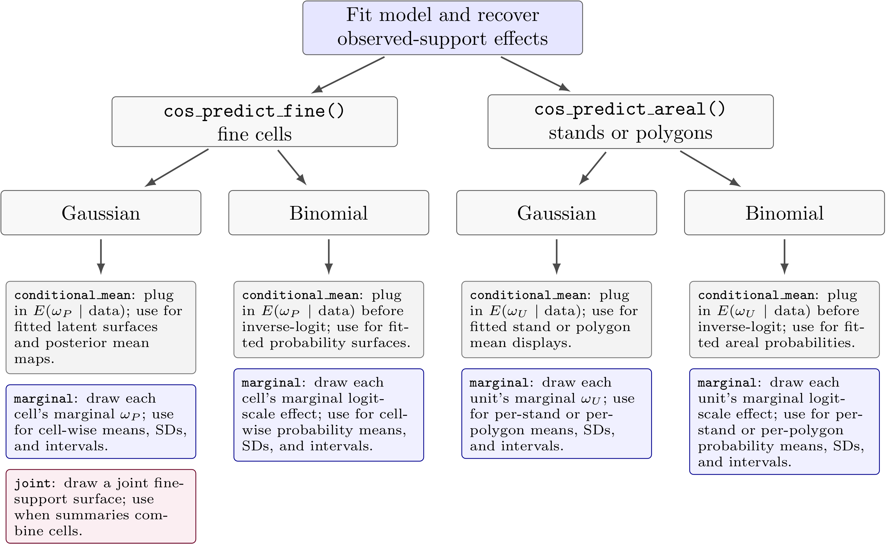

```{r setup}
#| include: false
knitr::opts_chunk$set(
  collapse = TRUE,
  comment = "#>",
  fig.width = 7,
  fig.height = 5,
  warning = FALSE,
  message = FALSE
)
```

## Purpose

This vignette gives the statistical and computational details behind
`cosTapered`. It is the technical companion to the introductory vignette. The
introductory vignette shows the user workflow; this vignette explains the model
parameterization, support averaging, nugget scaling, collapsed sampler,
recovery distributions, prediction targets, and computational tradeoffs.

The implementation is intentionally focused. It supports a tapered exponential
Gaussian process, proper normal regression priors, inverse-gamma variance
priors, a bounded uniform prior for the exponential decay parameter, simple S3
objects, and latent or observed prediction targets.

The separate `cosTapered-binomial` and `cosTapered-negative-binomial`
vignettes illustrate the experimental Polya-Gamma response paths. The
negative-binomial path supports fixed-size count responses with user-supplied
offsets such as log exposure.

For readers who want the model notation and posterior calculations in one
place, the package also installs a PDF model and software details document:
`cosTapered.pdf`. After installation, locate it with:

```{r appendix-path}
system.file("doc", "cosTapered.pdf", package = "cosTapered")
```

## Spatial supports

Let $A_i$, $i=1,\ldots,n_A$, denote raster cells on the fine support. Let
$s_i$ be the centroid of $A_i$. Let $B_l$, $l=1,\ldots,n_B$, denote
observed supports, and let $U_k$, $k=1,\ldots,n_U$, denote areal
prediction supports.

The fine-support covariate vector for cell $A_i$ is
$\mathbf{x}(A_i)\in\mathbb{R}^p$, and the fine-support covariate matrix is

$$
X =
\begin{bmatrix}
\mathbf{x}(A_1)^\top\\
\vdots\\
\mathbf{x}(A_{n_A})^\top
\end{bmatrix}.
$$

The package uses the columns supplied in `X_rast`. If an intercept is desired,
the user supplies an intercept raster layer.

Observed-support area weights are

$$
h_{li} = \frac{|B_l\cap A_i|}{|B_l|},
$$

where $|\cdot|$ denotes area. The observed-support aggregation matrix is
$H_{BA}$ with entries $h_{li}$. Prediction-support area weights are

$$
g_{ki} = \frac{|U_k\cap A_i|}{|U_k|},
$$

and define the conceptual aggregation matrix $H_{UA}$. In the implementation,
`cos_prepare()` stores $H_{BA}$ as a sparse matrix, while
`cos_make_areal_blocks()` stores prediction weights block by block.

## Fine-support model

The fine-support response is decomposed into a latent mean and independent
finite-support noise:

$$
y(A_i) = \eta(A_i) + \epsilon(A_i),
\qquad
\eta(A_i) = \mathbf{x}(A_i)^\top\beta+\omega(A_i).
$$

In vector form,

$$
\mathbf{y}_A = \boldsymbol{\eta}_A+\boldsymbol{\epsilon}_A,
\qquad
\boldsymbol{\eta}_A = X\beta+\boldsymbol{\omega}_A,
$$

with

$$
\boldsymbol{\epsilon}_A\mid\tau^2
\sim N(0,\tau^2 I_{n_A}).
$$

The noise term is a finite raster-cell noise term. It is not a continuous
point-level white-noise process. This matters because observed-support nugget
variance is obtained by averaging finite-cell noise terms through the support
weights.

## Tapered exponential covariance

The residual spatial process is Gaussian:

$$
\boldsymbol{\omega}_A\mid\sigma^2,\phi,\gamma
\sim
N\{0,\sigma^2 C_A^{tap}(\phi,\gamma)\},
$$

where

$$
[C_A^{tap}(\phi,\gamma)]_{ij}
=
\exp\{-\phi d(s_i,s_j)\}T_\gamma\{d(s_i,s_j)\}.
$$

Here $d(s_i,s_j)$ is Euclidean distance in the projected coordinate system,
$\phi>0$ is the exponential decay parameter, and $\gamma>0$ is the taper
distance. The taper distance is a hard covariance cutoff: if
$d(s_i,s_j)\geq\gamma$, the tapered covariance contribution is zero.

The package currently supports two compact tapers. For `taper_code = 1L`, the
Wendland taper is

$$
T_\gamma(d) =
\begin{cases}
(1-r)^4(1+4r), & 0\leq r < 1,\\
0, & r\geq 1,
\end{cases}
\qquad r=d/\gamma.
$$

For `taper_code = 2L`, the spherical taper is

$$
T_\gamma(d) =
\begin{cases}
1 - 1.5r + 0.5r^3, & 0\leq r < 1,\\
0, & r\geq 1.
\end{cases}
$$

The exponential effective range reported by the package is the distance at
which the exponential component alone drops to 0.05:

$$
\exp(-\phi r_{0.05})=0.05,
\qquad
r_{0.05}=-\log(0.05)/\phi\approx 3/\phi.
$$

The reported effective range is not the taper distance. The taper distance
$\gamma$ controls compact support of the covariance and must be chosen by
the user.

## Observed-support model

Observed responses are modeled as support averages of the fine-support
response:

$$
y(B_l) \approx \sum_{i=1}^{n_A} h_{li} y(A_i).
$$

Stacking observed responses gives

$$
\mathbf{y}_B
=
H_{BA}X\beta
+
H_{BA}\boldsymbol{\omega}_A
+
H_{BA}\boldsymbol{\epsilon}_A.
$$

Define

$$
X_B = H_{BA}X,
\qquad
\boldsymbol{\omega}_B = H_{BA}\boldsymbol{\omega}_A,
\qquad
D_h = H_{BA}H_{BA}^\top.
$$

Then

$$
\mathbf{y}_B\mid\beta,\boldsymbol{\omega}_B,\tau^2
\sim
N(X_B\beta+\boldsymbol{\omega}_B,\tau^2D_h).
$$

The observed-support spatial effects have prior

$$
\boldsymbol{\omega}_B\mid\sigma^2,\phi,\gamma
\sim
N\{0,\sigma^2C_B^{tap}(\phi,\gamma)\},
$$

where

$$
C_B^{tap}(\phi,\gamma)
=
H_{BA}C_A^{tap}(\phi,\gamma)H_{BA}^\top.
$$

Only fine-cell pairs with $d(s_i,s_j)<\gamma$ contribute. The package uses
this to precompute the contributing support-pair pattern for fixed observed
supports, raster cells, taper type, and taper distance. During MCMC, the code
rebuilds $C_B^{tap}(\phi,\gamma)$ by applying $\exp(-\phi d)$ to
precomputed distances and taper weights.

## Nugget scaling and tau_B_sq

The model is written in terms of the fine-support noise variance $\tau^2$.
However, observed data see this noise through $\tau^2D_h$. The package
therefore places the prior and MCMC proposal on the average observed-support
nugget variance

$$
\tau_B^2 = \tau^2\bar d_h,
\qquad
\bar d_h = \frac{1}{n_B}\sum_{l=1}^{n_B}D_h(l,l).
$$

Thus

$$
\tau^2=\tau_B^2/\bar d_h.
$$

This is a reparameterization of the same model. It does not imply that every
observed support has nugget variance $\tau_B^2$. For observed support
$B_l$,

$$
\mathrm{var}\{(H_{BA}\boldsymbol{\epsilon}_A)_l\}
=
\tau^2D_h(l,l)
=
\frac{\tau_B^2}{\bar d_h}D_h(l,l).
$$

When observed supports do not overlap in raster cells, $D_h$ is diagonal. If
supports overlap, $D_h$ can have nonzero off-diagonal entries. The package
uses the general matrix expression.

## Priors

The regression prior is proper normal:

$$
\beta\sim N(\mu_\beta,V_\beta).
$$

The variance priors use inverse-gamma distributions in shape-scale form:

$$
\tau_B^2 \sim \mathrm{IG}(a_\tau,b_\tau),
\qquad
\sigma^2 \sim \mathrm{IG}(a_\sigma,b_\sigma),
$$

where

$$
p(x) =
\frac{b^a}{\Gamma(a)}
x^{-(a+1)}
\exp(-b/x),
\qquad x>0.
$$

For spatial fits,

$$
\phi\sim \mathrm{Uniform}(\phi_L,\phi_U),
\qquad
0<\phi_L<\phi_U<\infty.
$$

Bounds can be chosen through approximate exponential effective ranges:

$$
\phi_L=3/r_{\max},
\qquad
\phi_U=3/r_{\min}.
$$

## Collapsed likelihood

`cos_fit()` samples covariance parameters from a collapsed posterior in which
$\beta$ and, for spatial fits, $\boldsymbol{\omega}_B$ have been
integrated out. For spatial fits define

$$
\theta_B=(\tau_B^2,\sigma^2,\phi).
$$

For each proposed $\tau_B^2$, the package converts to
$\tau^2=\tau_B^2/\bar d_h$ before constructing the covariance.

After integrating over $\beta$ and $\boldsymbol{\omega}_B$,

$$
\mathbf{y}_B\mid\theta_B
\sim
N(\mu_Y,V_Y),
$$

where

$$
\mu_Y = X_B\mu_\beta,
$$

and

$$
V_Y =
X_BV_\beta X_B^\top
+
\sigma^2C_B^{tap}(\phi,\gamma)
+
\tau^2D_h.
$$

Thus the collapsed posterior density is proportional to

$$
p(\theta_B\mid\mathbf{y}_B)
\propto
N(\mathbf{y}_B\mid\mu_Y,V_Y)
p(\tau_B^2)p(\sigma^2)p(\phi).
$$

For nonspatial fits, $\boldsymbol{\omega}_B$ is omitted and

$$
V_Y =
X_BV_\beta X_B^\top+\tau^2D_h.
$$

The package evaluates the Gaussian log density using a Cholesky factorization
of the $n_B\times n_B$ matrix $V_Y$. This is the main fitting cost for
moderate or large $n_B$.

## MCMC parameterization

The sampler works on an unconstrained scale. For spatial fits,

$$
z_\tau = \log\tau_B^2,
\qquad
z_\sigma = \log\sigma^2,
\qquad
z_\phi =
\log\left(\frac{\phi-\phi_L}{\phi_U-\phi}\right).
$$

The inverse transformation is

$$
\tau_B^2=\exp(z_\tau),
\qquad
\sigma^2=\exp(z_\sigma),
\qquad
\phi=\phi_U-\frac{\phi_U-\phi_L}{1+\exp(z_\phi)}.
$$

For the range parameter,

$$
\frac{d\phi}{dz_\phi}
=
\frac{(\phi-\phi_L)(\phi_U-\phi)}{\phi_U-\phi_L}.
$$

Thus, after dropping additive constants that do not affect Metropolis
acceptance probabilities, the transformed log target includes

$$
\log(\phi-\phi_L)
+
\log(\phi_U-\phi)
$$

for the bounded transformation of $\phi$. The full transformed target also
includes the log-Jacobian terms $\log\tau_B^2$ and $\log\sigma^2$ for the
log variance transformations. For nonspatial fits, the sampler uses only
$z_\tau=\log\tau_B^2$.

The internal sampler uses a random-walk block proposal and adapts a scalar
multiplier and covariance shape by batch. The package stores both
natural-scale samples and unconstrained-scale samples.

## Recovery of beta and omega_B

After fitting, `cos_recover_B()` retains a subset of covariance parameter
samples according to `burn_in`, `thin`, and optional `n_samples`. For each
retained draw, it samples $\beta$ and $\boldsymbol{\omega}_B$ from their
Gaussian full conditional.

For spatial fits, define

$$
\alpha =
\begin{bmatrix}
\beta\\
\boldsymbol{\omega}_B
\end{bmatrix},
\qquad
Z=[X_B,I_{n_B}].
$$

The likelihood is

$$
\mathbf{y}_B\mid\alpha,\tau^2
\sim
N(Z\alpha,\tau^2D_h).
$$

The prior is block Gaussian:

$$
\alpha
\sim
N\left[
\begin{bmatrix}
\mu_\beta\\
0
\end{bmatrix},
\begin{bmatrix}
V_\beta & 0\\
0 & \sigma^2C_B^{tap}(\phi,\gamma)
\end{bmatrix}
\right].
$$

Therefore

$$
\alpha\mid\mathbf{y}_B,\theta_B
\sim
N(Q_\alpha^{-1}b_\alpha,Q_\alpha^{-1}),
$$

where

$$
Q_\alpha =
\frac{1}{\tau^2}Z^\top D_h^{-1}Z
+
\begin{bmatrix}
V_\beta^{-1} & 0\\
0 & \sigma^{-2}\{C_B^{tap}(\phi,\gamma)\}^{-1}
\end{bmatrix}.
$$

The implementation samples from this conditional distribution using a
Cholesky factorization of $Q_\alpha$. It stores draws of $\beta$,
$\boldsymbol{\omega}_B$, and the observed-support latent mean

$$
\eta_B=X_B\beta+\boldsymbol{\omega}_B.
$$

For nonspatial fits, $\boldsymbol{\omega}_B=0$ and only $\beta$ is
recovered.

## Fine-support prediction

Fine-support prediction is implemented by `cos_predict_fine()`. For prediction
locations $P$, let $X_P$ be the prediction covariate matrix and let
$\boldsymbol{\omega}_P$ be the corresponding spatial residual vector. For a
retained posterior draw,

$$
\boldsymbol{\omega}_P
\mid
\boldsymbol{\omega}_B,\sigma^2,\phi,\gamma
\sim
N\{C_{PB}C_B^{-1}\boldsymbol{\omega}_B,\,
\sigma^2(C_{PP}-C_{PB}C_B^{-1}C_{BP})\}.
$$

The latent fine-support target is

$$
\eta_P = X_P\beta+\boldsymbol{\omega}_P.
$$

When `spatial_uncertainty = "conditional_mean"`, the package uses the
conditional mean of $\boldsymbol{\omega}_P$, so uncertainty summaries omit
conditional spatial prediction uncertainty. With
`spatial_uncertainty = "marginal"`, it draws independent marginal conditional
values for each fine prediction location. With
`spatial_uncertainty = "joint"`, it draws from the full joint conditional
distribution across the fine prediction locations, which can be expensive for
large prediction sets.

For `target = "observed"`, the package adds independent nugget draws:

$$
y_P = \eta_P+\epsilon_P,
\qquad
\epsilon_P\sim N(0,\tau^2I).
$$

## Areal prediction

For areal prediction unit $U_k$, the latent target is the support average

$$
\eta(U_k)
=
\sum_i g_{ki}\eta(A_i).
$$

For `target = "observed"`, the observed support prediction is

$$
y(U_k)=\eta(U_k)+\epsilon(U_k),
$$

where

$$
\epsilon(U_k)\sim
N\left(0,\tau^2\sum_i g_{ki}^2\right).
$$

The package reports areal means, not totals. Users should multiply by their
chosen area units outside the package if totals are needed.

For areal prediction, `spatial_uncertainty = "conditional_mean"` uses
conditional means of the unobserved areal spatial effects and therefore omits
conditional spatial prediction uncertainty. `spatial_uncertainty = "marginal"`
adds marginal conditional uncertainty for each areal unit, but those samples
are not joint samples across units. They should not be used for totals,
contrasts, rankings, or other summaries that require cross-unit posterior
covariance.

## Practical prediction guidance

Prediction has three separate choices: support, response target, and spatial
uncertainty. Keeping those choices separate makes the estimand explicit.
Choose the combination that matches the inferential target first; runtime is
secondary.
For Gaussian fits, `target = "latent"` estimates the underlying support mean,
excluding nugget variation. This is usually the target for stand, polygon,
inventory, and mapped-condition summaries. `target = "observed"` adds the
Gaussian nugget contribution on the requested support, so it targets the
observed response on that support rather than the underlying support mean. For
statistically coherent estimates of individual stands, polygons, or cells with
posterior SDs and intervals, use `spatial_uncertainty = "marginal"`.
That option gives valid marginal summaries for each unit considered
separately. It does not give joint samples across units, so it is not
appropriate for totals, rankings, contrasts, or allocation rules that need
cross-unit posterior covariance.

If the target is a collection of stands or polygons as one aggregate
estimand, first dissolve those boundaries to the union support and predict that
union. Do not create uncertainty for the collection by adding independently
drawn marginal predictions from separate stands.

The figure below summarizes the Gaussian and binomial spatial-uncertainty
paths. Negative-binomial prediction follows the same Polya-Gamma
`conditional_mean` or `marginal` spatial-uncertainty choices as binomial,
with mean-count summaries for `target = "latent"` and count draws for
`target = "observed"`.

```{r prediction-decision-figure, echo = FALSE, out.width = "100%", fig.cap = "Prediction uncertainty choices for Gaussian and binomial paths in cosTapered. The key distinction is whether samples represent conditional means, independent marginal uncertainty for each prediction unit, or a joint fine-support Gaussian surface. Gray boxes are plug-in conditional-mean summaries. Blue boxes are marginal prediction-unit summaries, appropriate for stand, polygon, or cell estimates interpreted one unit at a time. Purple boxes are joint fine-support samples for summaries that combine cells. Runtime can differ substantially among paths, but the inferential target should determine the choice."}

```

The choices mean:

- `target = "latent"` summarizes the underlying support mean on the model
  scale.
- For Gaussian fits, `target = "observed"` adds the Gaussian nugget
  contribution on the requested support: fine-cell nugget variation for fine
  predictions and support-averaged nugget variation for areal predictions. For
  negative-binomial fits, `target = "observed"` simulates count draws around
  the latent mean.
- `spatial_uncertainty = "conditional_mean"` plugs in the conditional mean of
  unobserved spatial effects. It is a fitted-surface or plug-in summary, not a
  full prediction-uncertainty summary.
- `spatial_uncertainty = "marginal"` draws independent marginal conditional
  spatial effects for each prediction cell or unit. It is the right choice for
  valid per-cell, per-stand, or per-polygon means, SDs, and intervals when
  units are interpreted separately.
- `spatial_uncertainty = "joint"` draws a joint Gaussian fine-support surface
  and is available for Gaussian fine prediction only. Use it when the summary
  combines fine cells and therefore depends on cross-cell covariance.

## Missing raster cells and support targets

Support weights define the estimand. If an observed or prediction support
overlaps raster cells with incomplete covariates, simply dropping those cells
changes the support average. For this reason, `cos_prepare()` and
`cos_make_areal_blocks()` default to `missing = "error"` when incomplete
covariates would leave support-weight rows below one. Users can choose
`missing = "drop"` to keep covered-cell weights without rescaling, or
`missing = "renormalize"` to average over covered cells only. Those choices
should be made deliberately because they change the target support.

## Cross validation

`cos_cv_observed()` performs observed-support K-fold cross validation. For
each fold it refits the model to training polygons, treats held-out polygons as
prediction units, predicts their latent areal means, optionally adds
observed-support nugget draws, and scores posterior predictive samples.

The function can score:

* `target = "latent"` against known latent truth in simulation studies;
* `target = "observed"` against held-out observed responses;
* both targets from the same fold refits when `target = c("latent",
  "observed")` and `latent_col` is supplied.

This target distinction is important. Latent prediction checks whether the
model recovers the support-averaged spatial mean. Observed prediction checks
the response on that support with nugget variation included.

## Computational guidance

The main fitting cost is repeated Cholesky factorization of the observed-level
matrix $V_Y$. The main spatial-preparation cost is computing the support-pair
contributions within taper distance $\gamma$. Larger $\gamma$ values can
improve fidelity to long-range residual dependence, but they increase the
number of contributing fine-cell pairs and therefore memory and time.

Useful practical checks are:

* inspect row sums of support weights;
* choose `gamma` large enough to cover residual spatial dependence that
  matters for prediction;
* set `phi` bounds using plausible effective ranges;
* check that posterior `phi` is not stuck against a bound;
* use the nonspatial fit as a support-aware baseline;
* compare RMSPE, CRPS, coverage, and interval width for the prediction target
  that matches the inferential objective.

For applied guidance on when spatial COS should improve prediction, see the
spatial-guidance vignette.
