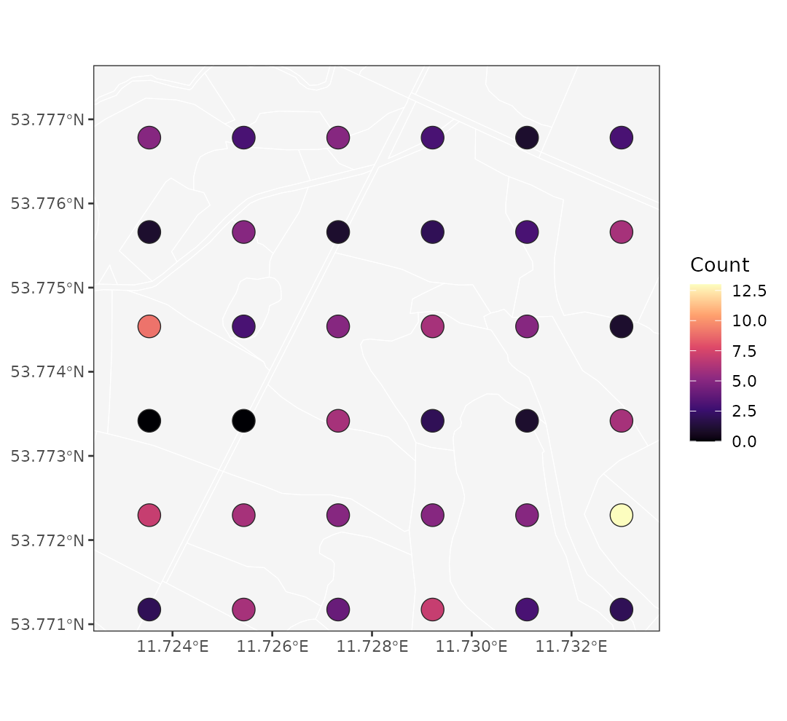
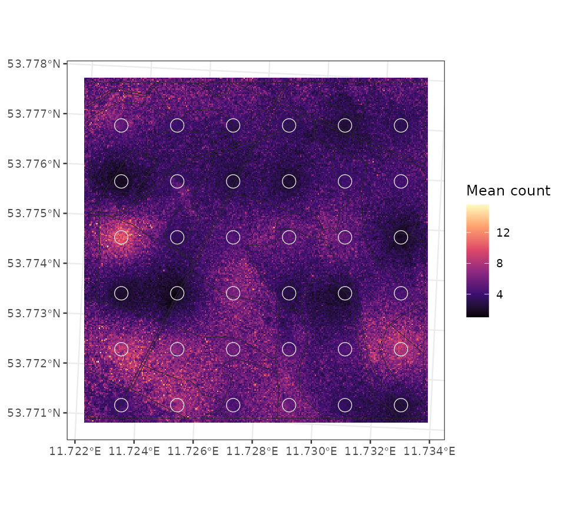
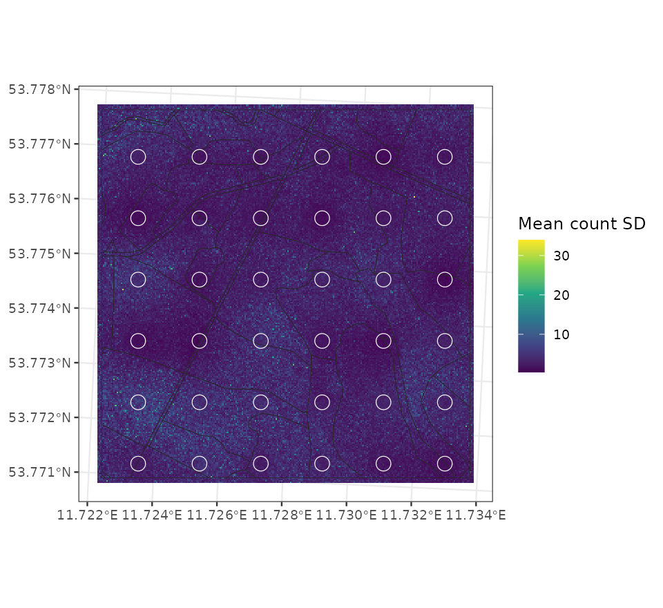
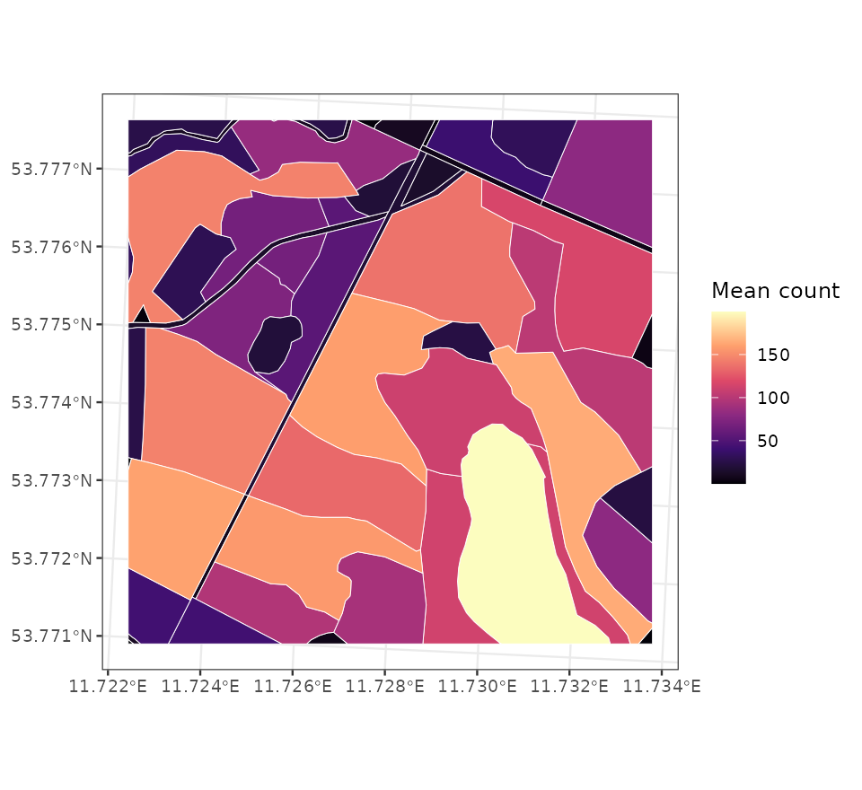
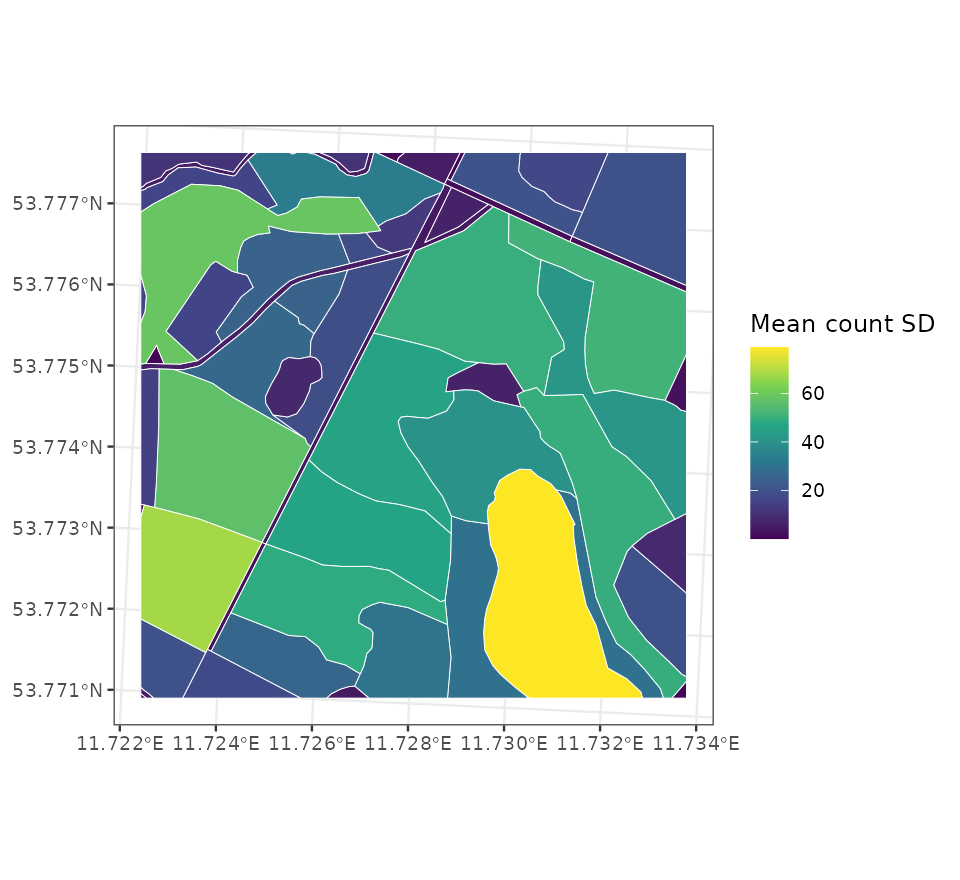

```{r setup}
#| include: false
knitr::opts_chunk$set(
  collapse = TRUE,
  comment = "#>",
  fig.width = 7,
  fig.height = 5,
  warning = FALSE,
  message = FALSE
)
```

This vignette illustrates the experimental fixed-size negative-binomial
response model in `cosTapered`. It is intended for overdispersed count
responses observed on plot or polygon supports. The response path uses the
same Polya-Gamma machinery as the binomial model, keeps `beta` and the
observed-support spatial effect `omega_B` explicit in the sampler state, and
uses a user-supplied negative-binomial `size` parameter.

The example uses the package's bundled raster covariate and plot polygons. We
simulate plot counts from a weak fine-support covariate effect, a stronger
spatial Gaussian process, and a log-exposure offset. We then fit the model,
predict the mean count over the full fine raster domain, and summarize counts
on areal prediction polygons.

The simulation, fitting, and prediction chunks are displayed without execution
so that vignette builds stay quick. Run them in order to reproduce the model
workflow. The figures and distance summaries are saved from an earlier example
run; they are not regenerated during a vignette build. The short chain and 12
retained draws demonstrate the API; use longer chains, more draws, and
convergence diagnostics for inference.

## Model

For observed support $B_l$, the fixed-size negative-binomial model is

$$
y_l \mid \eta_l, r \sim \mathrm{NegBin}(r, \mu_l),
\qquad
\mu_l = \exp(\eta_l),
\qquad
\eta_l = o_l + \mathbf{x}_B(B_l)^\top \beta + \omega_B(B_l),
$$

where $r$ is the supplied `size` parameter, $o_l$ is an optional offset such
as log exposure, and $\mathbf{x}_B(B_l)^\top$ is row $l$ of the
observed-support design matrix $X_B = H_{BA}X$ produced by `cos_prepare()`.
The spatial effect $\omega_B$ has the same tapered observed-support Gaussian
process prior used by the Gaussian COS model.

The package uses the `rnbinom(size = r, mu = mu_l)` parameterization. Larger
`size` values imply less overdispersion, and the Poisson limit is approached
as `size` becomes large. The current implementation treats `size` as fixed,
not estimated.

The offset is part of the linear predictor. If counts are measured over
different exposures, areas, times, or sampling efforts, supply the log
exposure used by the observed data and use compatible offsets for prediction.
Prediction offsets default to zero; fitted offsets are not automatically reused.

As in the binomial model, this likelihood is defined on the observed support.
For an areal prediction, the package averages covariates and spatial effects
on the link scale, adds the areal offset, and then exponentiates. The result
is not a sum or average of fine-cell expected counts.

## Simulate count plot data

The code below constructs the raster design matrix, prepares the observed
support, and simulates plot counts. The covariate coefficient is deliberately
small so most spatial structure comes from the Gaussian process rather than
the fine-support canopy covariate.

```{r}
#| eval: false
library(cosTapered)
library(sf)
library(raster)

set.seed(1)

chm <- raster(system.file("extdata", "example_chm.tif", package = "cosTapered"))
names(chm) <- "chm"

chm_vals <- getValues(chm)
chm_center <- mean(chm_vals, na.rm = TRUE)
chm_scale <- sd(chm_vals, na.rm = TRUE)

chm_z <- chm
chm_z[] <- (chm_vals - chm_center) / chm_scale
names(chm_z) <- "chm_z"

intercept <- chm
intercept[] <- ifelse(is.na(chm_vals), NA_real_, 1)
names(intercept) <- "intercept"

X_rast <- stack(intercept, chm_z)
names(X_rast) <- c("intercept", "chm_z")

B_sf <- st_read(
  system.file("extdata", "example_B.gpkg", package = "cosTapered"),
  quiet = TRUE
)
truth <- readRDS(system.file("extdata", "example_truth.rds", package = "cosTapered"))

prep0 <- cos_prepare(
  X_rast = X_rast,
  B_sf = B_sf,
  response_col = "y_B",
  gamma = truth$gamma,
  taper_code = truth$taper_code,
  spatial = TRUE,
  n_threads = 2,
  missing = "renormalize",
  verbose = FALSE
)

B_cent <- st_coordinates(st_centroid(st_geometry(B_sf)))
exposure_z <- as.numeric(scale(B_cent[, 1]))
plot_exposure <- exp(0.25 * exposure_z)
log_exposure <- log(plot_exposure)

beta_true <- c(intercept = 1.25, chm_z = 0.20)
sigma_sq_true <- 0.60
eff_range_true <- 250
phi_true <- 3 / eff_range_true
size_true <- 8

C_B_true <- cosTapered:::make_C_B_tapered_from_pairs_Rcall(
  C_B_pairs = prep0$C_B_pairs,
  phi = phi_true,
  n_threads = 2
)

R_C_true <- chol(C_B_true)
omega_B_true <- as.numeric(sqrt(sigma_sq_true) * t(R_C_true) %*% rnorm(nrow(prep0$X_B)))
eta_B_true <- as.numeric(log_exposure + prep0$X_B %*% beta_true + omega_B_true)
mu_B_true <- exp(eta_B_true)

B_sf$log_exposure <- log_exposure
B_sf$exposure <- plot_exposure
B_sf$y_nb <- rnbinom(nrow(B_sf), size = size_true, mu = mu_B_true)
```

In the run used for the figures below, the simulation produced a total count
of 147 over 36 plot observations, with a mean count of 4.08.

The plot counts are sparse relative to the fine raster domain. The fitted
surface must borrow information through the covariate, the support model, and
the spatial process.

{width="100%"}

## Fit the count model

The fixed-size count model uses `family = "negative_binomial"` and requires
`size`. The offset can be supplied as a numeric vector or as a column name in
`prep$B_sf`. The Gaussian fit's nugget variance is not part of this
likelihood.

```{r}
#| eval: false
prep <- cos_prepare(
  X_rast = X_rast,
  B_sf = B_sf,
  response_col = "y_nb",
  gamma = truth$gamma,
  taper_code = truth$taper_code,
  spatial = TRUE,
  n_threads = 2,
  missing = "renormalize",
  verbose = FALSE
)

priors <- cos_default_priors(
  prep = prep,
  beta_mu = c(intercept = 0, chm_z = 0),
  beta_sd = c(intercept = 2, chm_z = 1),
  sigma_shape = 2,
  sigma_scale = 1,
  phi_lower = 3 / 700,
  phi_upper = 3 / 40
)

fit <- cos_fit(
  prep = prep,
  priors = priors,
  family = "negative_binomial",
  size = size_true,
  offset = "log_exposure",
  n_chains = 1,
  starting = data.frame(sigma_sq = 0.60, phi = 3 / 250),
  tuning = c(log_sigma_sq = 0.25, z_phi = 0.25),
  n_batch = 25,
  batch_length = 5,
  seed = 1,
  n_threads = 2,
  verbose = FALSE
)

summary(fit)
```

For negative-binomial fits, `cos_recover_B()` selects the saved in-chain
`beta`, `omega_B`, and `eta_B` draws. It does not run the Gaussian conjugate
recovery step.

```{r}
#| eval: false
rec <- cos_recover_B(
  fit = fit,
  burn_in = 35,
  thin = 4,
  n_samples = 12,
  seed = 1,
  n_threads = 2,
  verbose = FALSE
)
```

## Fine-grid mean-count summaries

For a fine grid cell $a$, the conditional spatial mean and marginal variance
are

$$
E(\omega_a \mid \omega_B) = C_{aB} C_B^{-1}\omega_B,
\qquad
\mathrm{Var}(\omega_a \mid \omega_B) =
\sigma^2\{1 - C_{aB} C_B^{-1} C_{Ba}\}.
$$

For each retained posterior draw and prediction cell, the package draws
$\omega_a$ from this one-dimensional normal conditional distribution, forms
$\eta_a = o_a + x_a^\top\beta + \omega_a$, transforms with `exp()`, and
summarizes the resulting mean-count draws. No joint fine-grid covariance
matrix is formed.

Here `offset_pred = 0`, so the fine-grid map is a unit-exposure mean count
surface. If the scientific target is a count for a particular pixel area,
sample duration, or effort, use the corresponding log exposure in
`offset_pred`.

```{r}
#| eval: false
pred_cell <- which(stats::complete.cases(raster::getValues(X_rast)))
pred_coords <- raster::xyFromCell(X_rast[[1]], pred_cell)
X_pred <- as.matrix(raster::extract(X_rast, pred_cell))
colnames(X_pred) <- names(X_rast)

pred_fine <- cos_predict_fine(
  fit = fit,
  rec_B = rec,
  pred_coords = pred_coords,
  X_pred = X_pred,
  offset_pred = 0,
  spatial_uncertainty = "marginal",
  target = "latent",
  keep_samples = FALSE,
  verbose = FALSE
)
```

The fitted unit-exposure mean-count surface from the example run is:

{width="100%"}

The next figure shows posterior standard deviations for the marginal
mean-count summaries. These are independent marginal summaries by cell, not a
joint simulated surface. Set `keep_samples = TRUE` to also retain draws
and obtain posterior quantiles for intervals.

{width="100%"}

The distance summary from the same run was:

```{r}
#| echo: false
data.frame(
  mean_distance_to_plot_m = c(19.69, 36.01, 46.77, 55.63, 63.89, 82.28),
  mean_count_sd = c(2.858, 3.272, 3.450, 3.538, 3.604, 3.871),
  eta_sd = c(0.628, 0.687, 0.710, 0.724, 0.734, 0.760)
)
```

The posterior SD of the mean count increases with distance from the nearest
observed plot, which is the expected behavior for marginal spatial
prediction. The full mean-count uncertainty also includes fixed-effect and
covariance-parameter uncertainty.

## Areal count summaries

Fine-grid maps are useful diagnostics, but count summaries are often needed
for stands or other areal units. `cos_make_areal_blocks()` builds the support
weights, and `cos_predict_areal()` returns link-scale and mean-count summaries
for each polygon.

In this example, the areal offset is the log of polygon area divided by the
mean observed plot area. This makes the areal predictions expected counts for
each polygon under an area-based exposure convention. For a real analysis,
the offset should represent the exposure or sampling effort that defines the
count target.

```{r}
#| eval: false
U_sf <- st_read(
  system.file("extdata", "example_U.gpkg", package = "cosTapered"),
  quiet = TRUE
)

U_blocks <- cos_make_areal_blocks(
  U_sf = U_sf,
  X_rast = X_rast,
  id_col = "U_id",
  missing = "renormalize",
  verbose = FALSE
)

B_area_mean <- mean(as.numeric(st_area(B_sf)))
U_blocks$U_sf$log_exposure <- log(as.numeric(st_area(U_blocks$U_sf)) / B_area_mean)

pred_areal <- cos_predict_areal(
  fit = fit,
  rec_B = rec,
  U_blocks = U_blocks,
  offset_U = "log_exposure",
  spatial_uncertainty = "marginal",
  target = "latent",
  keep_samples = FALSE,
  verbose = FALSE
)
```

The areal posterior mean counts are:

{width="100%"}

The areal posterior mean-count standard deviations are:

{width="100%"}

Use `target = "latent"` when the target is the expected count $\mu_U$.
Use `target = "observed"` when the target is a future or replicated count
observation on the same support and exposure. The observed target adds
negative-binomial sampling variation around the latent mean.

```{r}
#| eval: false
pred_areal_observed <- cos_predict_areal(
  fit = fit,
  rec_B = rec,
  U_blocks = U_blocks,
  offset_U = "log_exposure",
  spatial_uncertainty = "marginal",
  target = "observed",
  keep_samples = TRUE,
  verbose = FALSE
)

head(pred_areal_observed$summary)
```

For inference on individual stands, the marginal areal summaries are usually
the relevant output. If stands will be combined into a larger reporting unit,
predict directly for that dissolved reporting unit so the support and offset
match the estimand.

The code above reproduces the simulation, fit, and prediction workflow.
The original figure-generation script is not included in the public package.
