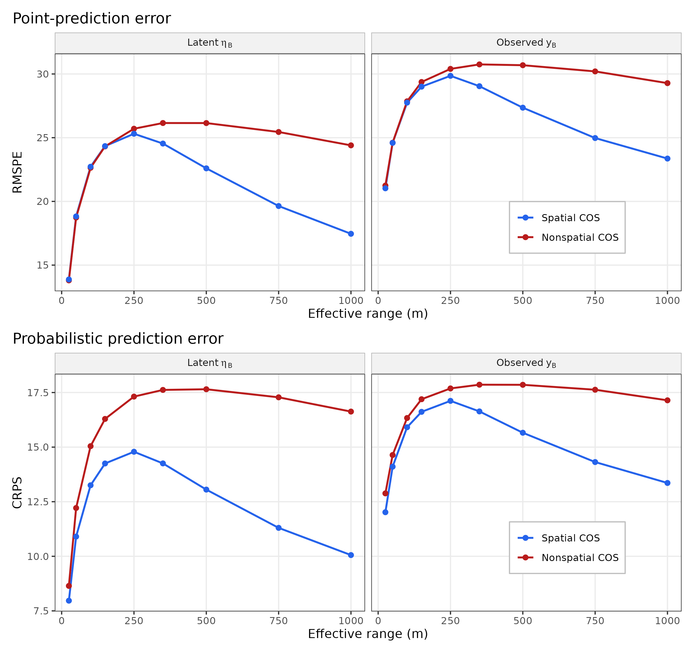
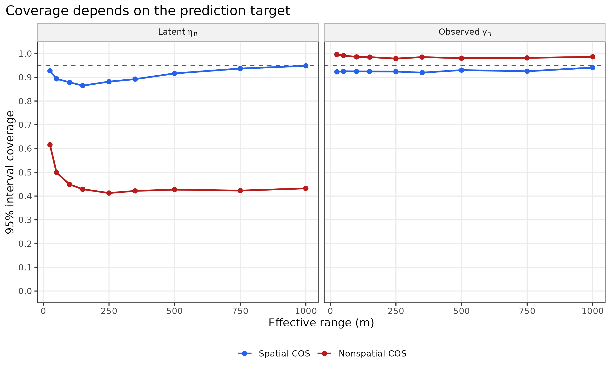
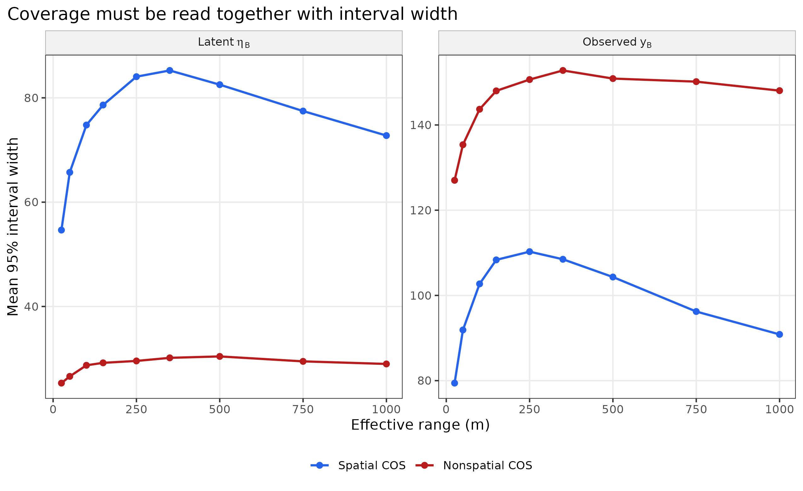
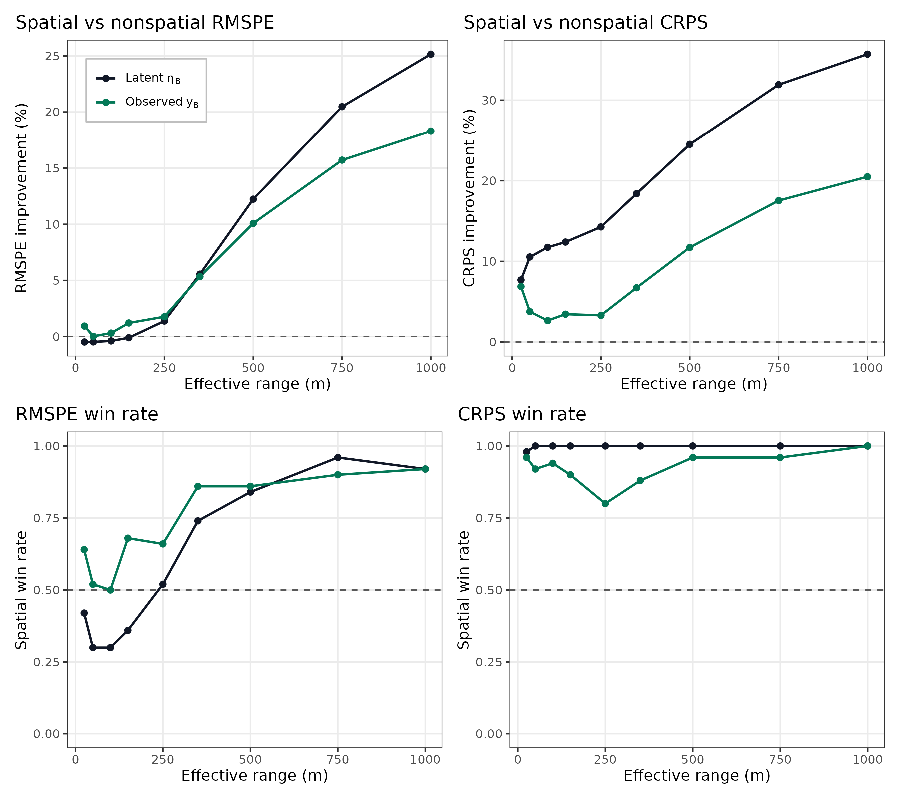
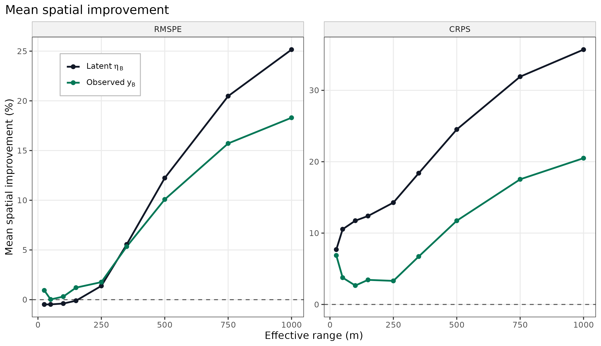

```{r setup}
#| include: false
knitr::opts_chunk$set(
  collapse = TRUE,
  comment = "#>",
  fig.width = 7,
  fig.height = 5,
  warning = FALSE,
  message = FALSE
)
```

## Overview and practical guidance

This vignette helps users decide when the spatial change-of-support (COS)
model is worth fitting, and whether prediction should target a latent areal
mean or an observed areal response that includes nugget variation. The short
answer is that the spatial COS model is most useful when the response contains
residual spatial structure that is strong enough, and persistent enough over
distance, for nearby observed supports to inform held-out supports after
covariates have been accounted for.

The main practical recommendations are:

1. Use the spatial COS model when residual spatial dependence is expected at
   distances comparable to the separation among observed supports and
   prediction units.
2. Use the nonspatial COS model when residual spatial structure is weak,
   short-ranged relative to the sampling design, or not important for the
   inferential objective.
3. Decide first whether the inferential objective is the latent areal mean
   $\eta_B$ or the observed areal response $y_B$. These are different
   prediction and validation targets.
4. Do not interpret high observed-target coverage by itself as evidence of
   useful prediction. A model can achieve high coverage by producing very wide
   predictive intervals.
5. Compare RMSPE, CRPS, interval coverage, and interval width. RMSPE
   summarizes point-prediction error, while CRPS rewards predictive
   distributions that are both calibrated and sharp.

The simulation study described below supports these recommendations. With the
example data design used here, spatial RMSPE gains are near zero at short
effective ranges, but reach about 25% for latent $\eta_B$ and about 18% for
observed $y_B$ at a 1000 m effective range. CRPS favors the spatial model
across the full range grid, with gains increasing as the spatial process
becomes longer-ranged.

## Objectives

The objective is to clarify when users should expect the spatial COS model to
improve over the nonspatial COS model. The comparison is not whether spatial
modeling is generally appealing, but whether it improves prediction enough to
justify the extra model component and computation for a given dataset.

We focus on three user-facing questions:

1. How strong and long-ranged must the residual spatial process be before the
   spatial COS model improves predictive performance?
2. How do conclusions change when the prediction target is latent $\eta_B$
   rather than observed $y_B$?
3. How should users interpret RMSPE, CRPS, coverage, and interval width when
   comparing spatial and nonspatial COS fits?

We answer these questions using a repeated simulation study based on the
package example dataset. The design keeps the covariate raster, forest
boundary, observed-support layout, and cross-validation folds fixed. It varies
only the simulated spatial process and nugget realization across replicates
and changes the effective range across scenarios.

## Where the reproducibility code lives

Long-running simulation code is not run inside this vignette because package
users need vignettes to build quickly. The source code for the study is
installed with the package, and selected figures are included in the vignette:

* keep the vignette text and selected figures in `vignettes/`;
* place long-running reproduction scripts in `inst/scripts/`, so they are
  installed with the package and available through `system.file()`.

For this vignette, the installed reproduction script is:

```{r script-path}
system.file("scripts", "spatial-cos-guidance-repeated-study.R",
            package = "cosTapered")
```

To run it after installing the package:

```{r run-script, eval = FALSE}
script <- system.file("scripts", "spatial-cos-guidance-repeated-study.R",
                      package = "cosTapered")
source(script)
```

## Prediction targets

The distinction between latent and observed prediction targets is central. Let
$B_l$, $l=1,\ldots,n_B$, denote an observed support. The latent areal mean
is

$$
\eta(B_l)
=
\sum_i h_{li}
\left\{
x(A_i)^\top\beta+\omega(A_i)
\right\},
$$

where $h_{li}$ are the area weights connecting observed support $B_l$ to
fine support cells $A_i$. This target excludes the nugget term. It is the
underlying support-averaged forest condition implied by the regression and
spatial process.

The observed areal response is

$$
y(B_l)=\eta(B_l)+\epsilon(B_l),
$$

where

$$
\epsilon(B_l)\sim
N\left(0,\tau^2\sum_i h_{li}^2\right)
$$

when fine-support nugget terms are independent.

Predicting $\eta_B$ asks for the latent support average. Predicting $y_B$
asks what value would be observed if the support were measured again with
nugget variation included. The observed target is therefore intrinsically
noisier, and predictive intervals should be wider.

## Simulation design

The study was generated using the package example canopy-height raster and
forest boundary. For each simulation, the covariate stack contained an
intercept raster and the example canopy-height raster. The true regression
coefficients were

$$
\beta = (-10,\ 15.87132)^\top,
$$

for the intercept and canopy-height covariate. The observed-support nugget
variance was set to

$$
\tau_B^2 = 250,
$$

and the spatial variance was set to

$$
\sigma^2 = 750.
$$

The effective range grid was

$$
25,\ 50,\ 100,\ 150,\ 250,\ 350,\ 500,\ 750,\ 1000\ \mathrm{m}.
$$

For the exponential covariance, the effective range is the distance where
correlation has dropped to about 0.05, approximated as $3/\phi$.

The observed-support design used $n_B=49$ circular plots with radius 16 m.
The domain, plot locations, and fold assignment were fixed across all
simulation scenarios. For each effective range, 50 independent process and
nugget realizations were generated. The cross-validation design used 10 folds.
Holding the domain, design, and fold assignment fixed isolates the role of the
spatial process.

For each replicate and effective range, two models were fit:

1. a spatial COS model with regression, observed-support nugget, spatial
   variance, and spatial range;
2. a nonspatial COS model with regression and observed-support nugget, but no
   residual spatial process.

Both models used the same held-out folds. Each cross-validation refit scored
both $\eta_B$ and $y_B$ targets.

## Recorded summaries

For each combination of replicate, effective range, model, and target, the
study recorded RMSPE, MAE, bias, correlation, slope, CRPS, 95% interval
coverage, and mean 95% interval width.

For model comparison, the spatial improvement in RMSPE was computed as

$$
100
\frac{
\mathrm{RMSPE}_{\mathrm{nonspatial}}
-
\mathrm{RMSPE}_{\mathrm{spatial}}
}{
\mathrm{RMSPE}_{\mathrm{nonspatial}}
}.
$$

Positive values indicate better performance for the spatial model. The same
definition was used for CRPS. The study also recorded spatial win rates, the
proportion of the 50 replicates for which the spatial model had lower RMSPE or
CRPS than the nonspatial model.

## Predictive accuracy and scoring rules

The next figure compares RMSPE and CRPS for spatial and nonspatial COS fits
across the effective range grid.

```{r accuracy-scoring, echo = FALSE, out.width = "95%", fig.cap = "Mean RMSPE and CRPS by effective range, prediction target, and model. RMSPE measures point-prediction error. CRPS scores the full predictive distribution, so it rewards predictions that are both accurate and appropriately uncertain."}

```

The RMSPE panels show that the value of residual spatial modeling depends
strongly on the range of the spatial process. At effective ranges of 25 to
150 m, the spatial model gives little RMSPE improvement over the nonspatial
model. This is the setting where residual spatial dependence decays too
quickly to provide much information about held-out supports from the training
supports.

As the effective range increases, the spatial model begins to improve RMSPE.
At 500 m, mean RMSPE improvement is about 12.2% for latent $\eta_B$ and
10.1% for observed $y_B$. At 1000 m, the improvements increase to about
25.2% and 18.3%, respectively.

The CRPS panels show a stronger and more stable spatial advantage. Even when
RMSPE differences are small at short ranges, CRPS favors the spatial model.
This means the spatial model is producing a better predictive distribution,
not only a better posterior mean.

## Coverage and interval width

Coverage is useful only when interpreted with interval width. The next two
figures show 95% interval coverage and mean 95% interval width.

```{r coverage, echo = FALSE, out.width = "95%", fig.cap = "Mean 95% interval coverage by effective range, prediction target, and model. The dashed line is nominal 95% coverage."}

```

```{r width, echo = FALSE, out.width = "95%", fig.cap = "Mean 95% interval width by effective range, prediction target, and model. Coverage should be judged together with interval width because wide intervals can produce high coverage without precise prediction."}

```

For the latent target $\eta_B$, the nonspatial model undercovers badly. Mean
coverage is roughly 0.41 to 0.62 across the range grid. This is expected:
when the validation target is the latent spatial mean, omitted residual
spatial structure is not represented by the nugget component. The spatial
model has much better latent-target coverage, roughly 0.86 to 0.95.

For the observed target $y_B$, the nonspatial model has very high coverage,
about 0.98 to 1.00. This does not mean the nonspatial model is making sharp
predictions. Its observed-target intervals are very wide, with mean widths
around 127 to 153. The spatial observed-target intervals are narrower, about
79 to 110, while maintaining coverage near 0.92 to 0.94.

The practical lesson is that observed-target validation can make the
nonspatial model look well calibrated if users focus only on coverage. For
decision making, a model that achieves similar coverage with narrower
intervals is more informative.

## Spatial improvement and win rates

The next figure summarizes spatial improvement in RMSPE and CRPS, together
with win rates across the 50 repeated process realizations.

```{r improvement-wins, echo = FALSE, out.width = "95%", fig.cap = "Mean percent improvement for the spatial model relative to the nonspatial model, and the proportion of repeated simulations in which the spatial model wins. Positive percent improvement means lower error for the spatial model."}

```

At short ranges, the spatial model is not consistently better for point
prediction. For latent $\eta_B$, mean RMSPE improvement is slightly negative
from 25 to 150 m. By 350 m, latent-target improvement is about 5.6%; by
750 m it is about 20.5%; and by 1000 m it is about 25.2%. The observed target
follows the same broad pattern, with about 5.3% improvement at 350 m and about
18.3% at 1000 m.

CRPS improvement is positive for both targets across all ranges. This is
important because the spatial model can improve uncertainty quantification
even when the posterior mean is not much better. Win rates help separate
stable improvements from averages driven by a few simulations. At 750 and
1000 m, RMSPE win rates are at least 0.90 for both targets.

The final figure gives a compact view of the mean improvement curves without
the win-rate panels.

```{r mean-improvement, echo = FALSE, out.width = "95%", fig.cap = "Mean spatial improvement in RMSPE and CRPS by effective range and prediction target."}

```

Spatial gains increase with effective range. They are larger and more
consistent for CRPS than for RMSPE. They are generally larger for latent
$\eta_B$ than for observed $y_B$, because observed-target prediction
includes nugget variation that no spatial model can fully predict.

## Choosing latent or observed prediction

The target should be chosen from the inferential objective, not from which
score looks better. In other words, decide whether the analysis is trying to
learn the underlying support average or predict the observed response on that
support.

Use latent prediction when the target is the underlying support average:

$$
\eta_U =
\sum_i g_{ki}\{x(A_i)^\top\beta+\omega(A_i)\}.
$$

This is often the relevant target for mapping forest condition, estimating
stand means, ranking management units, or summarizing expected resource
status. It excludes support-level nugget variation. In the package, this
corresponds to `target = "latent"` in areal or fine prediction functions.

Use observed prediction when the target is the measured response on the
support:

$$
y_U = \eta_U+\epsilon_U.
$$

For areal support $U$, the nugget variance is

$$
\mathrm{Var}(\epsilon_U)
=
\tau^2\sum_i g_{ki}^2.
$$

This is appropriate for cross validation against held-out observed responses
or for predictions that should include measurement-scale variation. In the
package, this corresponds to `target = "observed"`.

## Choosing spatial or nonspatial COS

The nonspatial COS model is not a naive baseline. It still respects support
averaging and uses the raster covariates. It is appropriate when residual
spatial structure is negligible, short-ranged relative to the spacing of
observed supports, or not important for the inferential objective.

The spatial COS model is appropriate when residual spatial dependence remains
after covariates have been included. Its advantage is largest when the
effective range is long enough that training supports provide information
about held-out or prediction supports. The simulation suggests the following
pattern for this dataset:

1. Short effective range, 25 to 150 m: little RMSPE gain from the spatial
   model. CRPS can still improve, but point-prediction advantage is limited.
2. Intermediate effective range, 250 to 500 m: spatial gains emerge. The
   spatial model begins to win more often in RMSPE and provides clearer CRPS
   gains.
3. Long effective range, 750 to 1000 m: spatial modeling is strongly useful.
   RMSPE, CRPS, and win rates all favor the spatial model.

These range groupings are not universal. They depend on plot spacing, support
sizes, covariate strength, nugget variance, and prediction-unit geometry. The
transferable principle is that the spatial process must operate at distances
that connect observed and prediction supports.

## Recommendations

For applied analyses:

1. Define the prediction target first. Use $\eta$ for latent support
   averages and $y$ for observed responses that include nugget variation.
2. Fit the nonspatial COS model as a support-aware baseline.
3. Fit the spatial COS model when residual spatial structure is plausible and
   the number of observed supports can support estimation of $\sigma^2$ and
   $\phi$.
4. Compare models using RMSPE, CRPS, coverage, and interval width. Do not rely
   on coverage alone.
5. Interpret spatial gains relative to the sampling design.
6. Prefer the spatial model when it improves CRPS and maintains reasonable
   coverage with sharper intervals, even if RMSPE gains are modest.
7. Prefer the nonspatial model when spatial gains are negligible or the
   spatial fit adds computation without improving predictive distributions.

The central message is that the spatial COS model is most valuable when
residual spatial dependence creates information that can be shared across
supports. Users should align the prediction target with the inferential
objective, then evaluate whether the data show enough residual spatial process
to justify spatial COS prediction.
