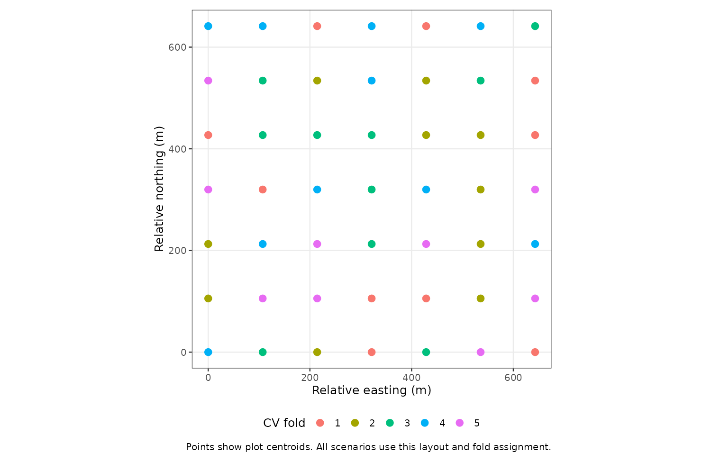
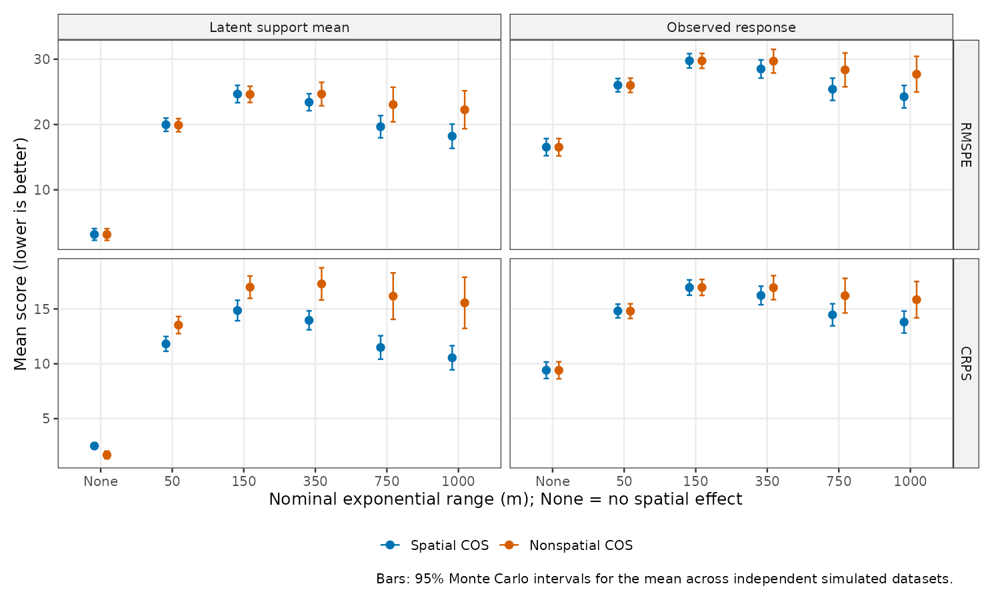
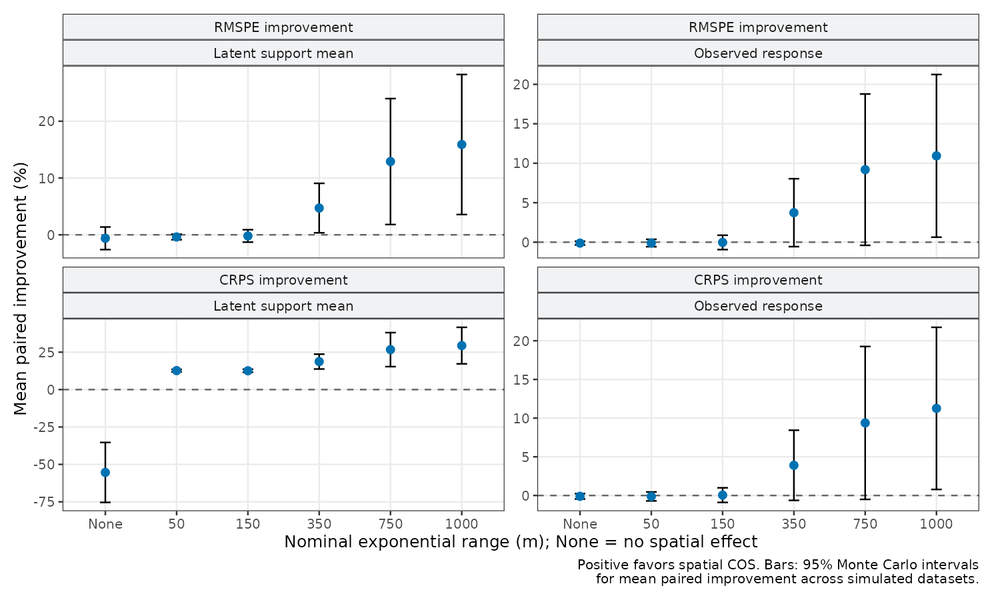
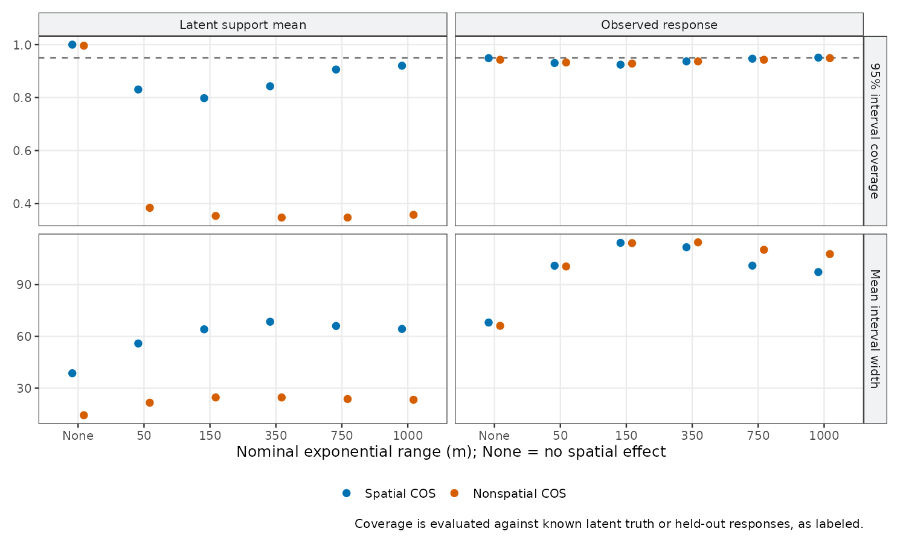
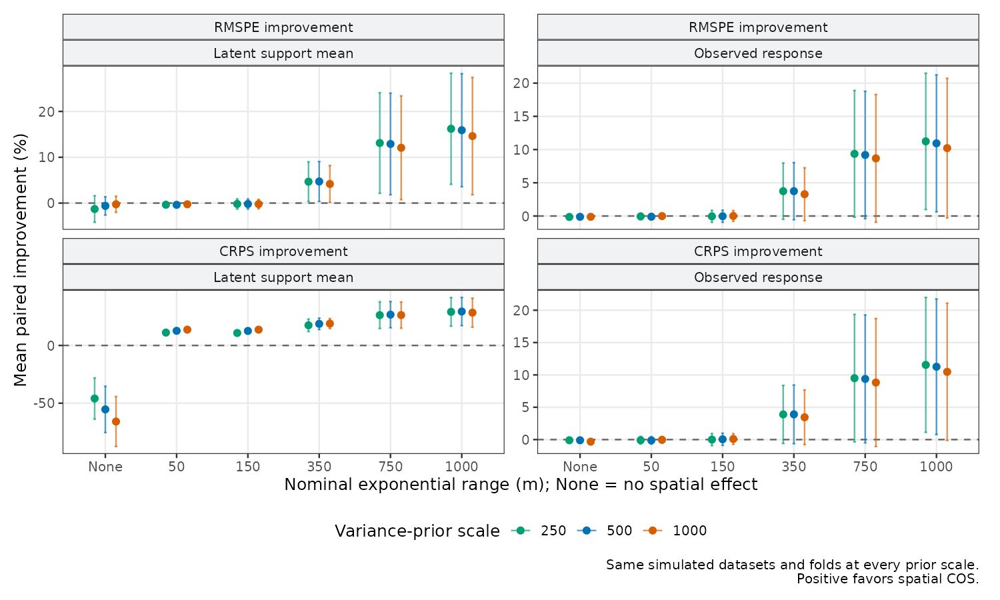

```{r setup}
#| include: false
knitr::opts_chunk$set(
  collapse = TRUE,
  comment = "#>",
  fig.width = 7,
  fig.height = 5,
  warning = FALSE,
  message = FALSE
)
```

## What this article can tell you

Spatial COS is useful when residual spatial dependence lets observed supports
inform prediction supports after accounting for covariates. Whether that
happens depends on the sampling layout, support sizes, covariance, and prediction
target. An effective range in meters is not a universal model-selection rule.

This article combines practical guidance with a reproducible **Gaussian
simulation example**. It compares spatial and nonspatial COS on identical
held-out plots, includes a case with no spatial effect, and checks sensitivity
to prior scales. The simulation is deliberately limited to one landscape and
one plot design; it does not establish performance for binomial or
negative-binomial models, other landscapes, or spatial extrapolation.

The main steps for an applied analysis are:

1. Define whether the target is a latent support mean or an observed response.
2. Fit a nonspatial COS baseline with the same covariates and support weights.
3. Evaluate the spatial model on validation splits that resemble the intended
   prediction task.
4. Compare prediction error and predictive distributions, including interval
   width and coverage together.
5. Check posterior sampling and whether the conclusion depends on the priors.

## Match the prediction target to the question

For an observed support $B_l$, the Gaussian latent mean is

$$
\eta(B_l) = \sum_i h_{li}\{x(A_i)^\top\beta + \omega(A_i)\}.
$$

The measured response is

$$
\begin{aligned}
y(B_l) &= \eta(B_l) + \epsilon(B_l),\\
\operatorname{Var}\{\epsilon(B_l)\} &= \tau^2 \sum_i h_{li}^2.
\end{aligned}
$$

The weights $h_{li}$ connect the fine raster cells to the observed support.
The nugget formula assumes independent fine-cell nugget terms. The same
expressions apply to a new areal unit $U_k$ using its weights $g_{ki}$.

Use `target = "latent"` for the underlying support mean. Use
`target = "observed"` for a response that includes nugget variation. The
latter needs wider predictive intervals because the nugget is not known.

In this simulation both targets are known, so they can be scored separately.
**In ordinary observed-data cross-validation, score observed predictions
against held-out responses.** A held-out noisy response is not ground truth
for a latent mean. The package requires a `latent_col` containing a known
latent target when `cos_cv_observed()` scores `target = "latent"`.

For uncertainty at an individual prediction unit, request
`spatial_uncertainty = "marginal"`; the prediction functions' default
`"conditional_mean"` omits conditional variation in the unobserved spatial
effect. The CV function requests marginal uncertainty internally. Retaining
prediction draws and quantiles also requires `keep_samples = TRUE`.
Marginal areal draws do not supply the joint uncertainty needed for stand
contrasts, rankings, or totals across units.

## A controlled simulation comparison

The study uses fixed priors independent of all responses, a fixed taper
distance, multiple chains, and recorded convergence diagnostics. All
numerical summaries and figures below are generated from archived results.

The canopy raster is averaged from 3 m to **12 m cells** to make a repeated
study practical. All simulation, fitting, and prediction calculations use
this coarser fine-support grid. These results therefore concern this grid,
not the original 3 m analysis. Circular plots have a target radius of 16 m
and are clipped at the forest boundary. The layout and CV folds stay fixed.

```{r study-results}
#| include: false
results_dir <- system.file("extdata", "spatial-guidance", package = "cosTapered",
                           mustWork = TRUE)
read_result <- function(name) read.csv(file.path(results_dir, paste0(name, ".csv")))
study_summary <- read_result("summary")
study_gains <- read_result("improvement")
study_diagnostics <- read_result("diagnostics")
study_design <- read_result("design")
study_settings <- dget(file.path(results_dir, "settings.R"))
primary <- subset(study_gains, prior_scale == 500)
n_reps <- unique(primary$n_reps)
stopifnot(length(n_reps) == 1L, all(study_diagnostics$passed))
distances <- as.matrix(dist(study_design[c("X", "Y")]))
distances[outer(study_design$fold, study_design$fold, "==")] <- Inf
nearest_training <- apply(distances, 1, min)
gain <- function(target, range, metric, statistic = "mean") {
  z <- primary[primary$target == target & primary$eff_range == range, ]
  stopifnot(nrow(z) == 1L)
  sprintf("%.1f", z[[paste0(metric, "_improvement_pct_", statistic)]])
}
spatial_latent <- subset(study_summary, prior_scale == 500 & model == "spatial" &
                          target == "latent" & eff_range > 0)
observed_calibration <- subset(study_summary, prior_scale == 500 & target == "observed")
long_observed_gains <- subset(study_gains, eff_range == 1000 & target == "observed")
short_latent_coverage <- subset(study_summary, eff_range == 50 &
                                 model == "spatial" & target == "latent")
null_latent_gains <- subset(study_gains, eff_range == 0 & target == "latent")
format_range <- function(x) paste(sprintf("%.1f", range(x)), collapse = "–")
```

| Setting | Value |
|:--|:--|
| Observed plots | `r nrow(study_design)` |
| Replicates per generating case | `r n_reps` independent simulated datasets |
| Validation | `r study_settings$k_folds` random folds, identical for both models |
| Spatial cases | Nominal exponential ranges 50, 150, 350, 750, and 1000 m |
| Nonspatial truth case | $\sigma^2=0$ |
| Spatial truth cases | $\sigma^2=750$ |
| Nugget scale | $\tau_B^2=250$, the average observed-support nugget variance |
| Regression coefficients | $\beta=(-10,\ 15.87132)^\top$ |
| Taper | Wendland, fixed $\gamma=1500$ m in every case |
| Prior sensitivity | Inverse-gamma scales 250, 500, and 1000 |

Here $3/\phi$ is the **nominal exponential range**, where the exponential
component alone is about 0.05. Multiplying by the taper lowers correlation
further. Holding $\gamma$ fixed separates changes in exponential range from
changes in the taper cutoff. The fitted spatial models estimate $\phi$; the
true range is never supplied to their fitting priors or starting values.
Although fine-support $\sigma^2$ is fixed in the spatial cases, support
averaging attenuates short-range variation more strongly. Thus the areal
signal-to-noise ratio varies with range even though $\sigma^2$ is fixed.

{width="85%"}

For this design, the median distance from a held-out plot centroid to the
nearest training plot centroid is `r round(median(nearest_training))` m
(range `r round(min(nearest_training))`–`r round(max(nearest_training))` m).
The folds assess predictions among interspersed observed plots. Predicting
into distant unsampled regions calls for a different validation design;
these results do not measure that task.

### Priors and fitting

Both models use the same regression prior,
$\beta\sim N\{(0,0)^\top,\operatorname{diag}(100^2,10^2)\}$, and the same
observed-support nugget prior $\tau_B^2\sim\operatorname{IG}(2,b)$.
The spatial model additionally uses
$\sigma^2\sim\operatorname{IG}(2,b)$ and a uniform prior on
$\phi\in[3/1500,3/10]$.

The primary comparison uses $b=500$. Repeating it with $b=250$ and $b=1000$
checks sensitivity on the **same data and folds**. These are specified study
priors, not estimates from the simulated responses or their generating
parameters. Shared-parameter priors are identical across models, but the
extra spatial variance component means their full prior predictive
distributions are not identical.
Choose priors appropriate to the response and distance units in your own
analysis; these particular scales are choices for the simulation example.

`cos_cv_observed()` reuses the supplied fit's priors in every fold. That is
appropriate here because these priors do not depend on responses. If prior
scales are estimated from response data, an explicit fold loop must estimate
them from the **training observations only**. Calculating `var(y)` on the
complete dataset before cross-validation lets held-out responses influence
the fitted models.

Every fold is refitted with four chains from dispersed, prespecified starting
values. The first half of each chain is discarded. The script checks
rank-normalized split R-hat below 1.01 and bulk and tail effective sample
sizes of at least 400 for each sampled covariance parameter and log posterior.
These checks use the unthinned retained chains. Failed checks trigger longer
runs; unresolved failures stop publication of the figures. Diagnostics use
the [`posterior` package](https://mc-stan.org/posterior/reference/rhat.html).

::: {.table-responsive}

```{r diagnostic-summary}
#| echo: false
diag_summary <- do.call(rbind, lapply(split(study_diagnostics, study_diagnostics$model), function(z) {
  data.frame(Model = z$model[1],
             `Fold fits` = nrow(unique(z[c("rep_id", "eff_range", "prior_scale", "fold")])),
             `Maximum R-hat` = sprintf("%.4f", max(z$rhat)),
             `Minimum bulk ESS` = floor(min(z$ess_bulk)),
             `Minimum tail ESS` = floor(min(z$ess_tail)),
             check.names = FALSE)
}))
knitr::kable(diag_summary, row.names = FALSE)
```

:::

Final runs used `r format(min(study_diagnostics$iterations), big.mark = ",")`
to `r format(max(study_diagnostics$iterations), big.mark = ",")` iterations
per chain. Approximately `r min(study_diagnostics$prediction_draws)` posterior
predictive draws were used per held-out plot. Passing these diagnostics is a
useful check on computation, not proof of model adequacy or a guarantee that
all Monte Carlo error is negligible.

## Prediction accuracy and uncertainty

RMSPE measures point-prediction error; lower is better. CRPS scores the
predictive distribution; lower is better. The study first scores all held-out
plots within a simulated dataset, then averages those dataset-level scores.
Its Monte Carlo uncertainty treats each simulated dataset as one replicate;
it does not treat folds or plots as independent simulation replicates.
Error bars use the mean plus or minus a Student-$t$ multiplier times the
simulation SE, with `r n_reps - 1L` degrees of freedom. They are approximate
95% intervals for mean performance under this fixed design.

{width="100%"}

For each replicate, percentage improvement is

$$
100\,\frac{\mathrm{score}_{\mathrm{nonspatial}}-
                \mathrm{score}_{\mathrm{spatial}}}
               {\mathrm{score}_{\mathrm{nonspatial}}}.
$$

Positive values favor spatial COS. The table reports the mean of these paired
percentages and its simulation standard error (SE). It is not a percentage
computed from the two grand mean scores.

::: {.table-responsive}

```{r paired-improvement}
#| echo: false
primary <- primary[order(primary$eff_range, primary$target), ]
fmt_gain <- function(metric) sprintf("%.1f (SE %.1f)",
                                     primary[[paste0(metric, "_improvement_pct_mean")]],
                                     primary[[paste0(metric, "_improvement_pct_se")]])
knitr::kable(data.frame(
  Case = ifelse(primary$eff_range == 0, "No spatial effect", paste(primary$eff_range, "m")),
  Target = primary$target,
  `RMSPE gain (%)` = fmt_gain("RMSPE"),
  `CRPS gain (%)` = fmt_gain("CRPS"),
  `RMSPE win rate` = sprintf("%.0f%%", 100 * primary$RMSPE_win_mean),
  check.names = FALSE
), row.names = FALSE)
```

:::

{width="100%"}

In this run, RMSPE differences at 50 and 150 m are close to zero. Average gains
increase at the longer ranges. At 1000 m the mean paired RMSPE improvement is
`r gain("latent", 1000, "RMSPE")`% for latent means and
`r gain("observed", 1000, "RMSPE")`% for observed responses, with simulation
SEs of `r gain("latent", 1000, "RMSPE", "se")` and
`r gain("observed", 1000, "RMSPE", "se")` percentage points. The uncertainty
around these averages is substantial; the point estimates are not guaranteed
gains for a new dataset.

Latent CRPS favors spatial COS in the spatial truth cases, including the
short-range cases where point predictions barely change. The spatial model
represents uncertainty about an unobserved spatial effect that the nonspatial
latent mean omits. For observed responses, CRPS is essentially tied at short
ranges and improves on average at longer ranges.

The nonspatial truth case shows the other side of the comparison. Under
these priors, point prediction is similar, but the spatial model's extra
latent uncertainty worsens latent CRPS. Read the absolute scores alongside
percentages: a modest absolute difference can be a large percentage when the
baseline score is small.

### Coverage must be read with interval width

{width="100%"}

The spatial model's latent intervals still under-cover in this study: mean
coverage across the spatial truth cases ranges from
`r round(100 * min(spatial_latent$coverage_95_mean), 1)`% to
`r round(100 * max(spatial_latent$coverage_95_mean), 1)`%, below the nominal
95%. These are repeated-simulation coverage rates at fixed generating
parameters; a 95% posterior interval does not automatically attain 95%
coverage in that experiment. Better CRPS and satisfactory chain diagnostics
do **not** establish calibrated intervals. At ranges shorter than the plot
spacing, the data contain little correlation information to separate spatial
variance from nugget variance; the prior choices can matter substantially.

Observed-response coverage is closer to nominal for both models, ranging
from `r round(100 * min(observed_calibration$coverage_95_mean), 1)`% to
`r round(100 * max(observed_calibration$coverage_95_mean), 1)`% across cases
in the primary comparison. Spatial observed-response intervals become
narrower at the longer ranges, while their short-range widths are similar
to the nonspatial intervals.

For latent truth, nonspatial COS predicts $X_B\beta$, whereas spatial truth
also contains $\omega_B$. Nonspatial latent intervals need not cover this
omitted component. Poor latent coverage under spatial truth should not be
interpreted as a general failure of nonspatial regression intervals to cover
their own model's mean.

For observed responses, the nonspatial model can absorb unexplained variation
into its nugget. Whether this gives suitable coverage and useful interval
width is an empirical question. A nominal 95% interval with coverage near 1
is conservative in this study; high coverage alone is not evidence of better
uncertainty quantification. Compare the width, CRPS, and prediction errors too.

### Does the conclusion depend on the prior?

{width="100%"}

Changing the variance-prior scale does not reverse the near-ties in point
prediction at 50 and 150 m or the mean advantage at 1000 m. At 1000 m, mean
paired observed-response RMSPE improvements range from
`r format_range(long_observed_gains$RMSPE_improvement_pct_mean)`% across the
three scales. The simulation uncertainty around these estimates remains
substantial.

The latent predictive distribution is more sensitive. At 50 m, the spatial
model's latent interval coverage ranges from
`r format_range(100 * short_latent_coverage$coverage_95_mean)`% across the
priors, still below 95%. In the no-spatial-effect case, its latent CRPS is
`r format_range(-null_latent_gains$CRPS_improvement_pct_mean)`% worse than
the nonspatial baseline. Increasing the variance-prior scale widens latent
intervals in these two cases: that helps coverage under spatial truth but
adds unnecessary uncertainty under nonspatial truth. A prior choice that
leaves point predictions nearly unchanged can still affect uncertainty
quantification.

This sensitivity check varies variance-prior scales only. The regression
priors, covariance family, and range-prior bounds stay fixed. Additional
prior checks may be needed for a particular application.

## Using this guidance with your data

The study fixes the landscape, covariates, plot layout, support size, spatial
variance in non-null cases, nugget scale, and random fold assignment. It varies
range and prior scale. It therefore supplies examples of model behavior,
not a general threshold for how many meters of range or how much spatial
variance is needed. Ten replicates per case also leave noticeable simulation
uncertainty, as the error bars show.

For your analysis, choose validation units and separation distances that
match the planned predictions. Use the same folds for both models. Specify
priors without using held-out outcomes, inspect chain diagnostics, and check
whether conclusions change under plausible priors. Strong covariates,
coarser prediction supports, larger nugget variance, or a different sampling
layout can change the comparison.

A spatial model is a useful addition when it improves prediction or predictive
distributions for the actual target and deployment setting. When the gains
are small relative to their uncertainty, a nonspatial COS baseline may be
adequate. Its support averaging remains valuable even without a spatial effect.

## Reproduce and inspect the results

The complete scripts and the compact results behind this article are installed
with the package. The [results archive on GitHub](https://github.com/finleya/cosTapered/tree/main/cosTapered/inst/extdata/spatial-guidance)
also describes each file and records code and input checksums.
Long simulations are not executed when the vignette builds;
its tables read the saved CSV files. The figures are regenerated from those
same files after all diagnostic checks pass.

```{r reproduce-study}
#| eval: false
install.packages(c("posterior", "ggplot2"))
Sys.setenv(CTV_OUT_DIR = "spatial-cos-guidance-output")
# Optional on Linux/macOS: parallelize independent study cases.
# Sys.setenv(CTV_WORKERS = "4")
source(system.file("scripts", "spatial-cos-guidance-repeated-study.R",
                   package = "cosTapered"))
source(system.file("scripts", "spatial-cos-guidance-plots.R",
                   package = "cosTapered"))
```

The defaults run all six generating cases, ten replicates, three prior scales,
and five folds for each model. This is a substantial computation. `CTV_WORKERS`
controls parallel processes on Linux/macOS, while `CTV_N_THREADS` defaults to
one thread per process. A smaller trial can use `CTV_N_REPS=2`,
`CTV_EFF_RANGES=0,350`, and `CTV_PRIOR_SCALES=500` in a **different output
directory**; it does not reproduce the article's full results.

Each case is checkpointed. Running the same command resumes completed cases.
If a case exhausts its chain-length retries, increase `CTV_MAX_ATTEMPTS` to
allow longer chains; successful cases remain reusable. Changing the design,
priors, or other sampling settings requires a new output directory.

The output includes dataset-level scores, held-out predictions, paired
improvements, diagnostics for every fold fit, all retry attempts, settings,
input checksums, and session information. To inspect the packaged results:

```{r inspect-results}
#| eval: false
results <- system.file("extdata", "spatial-guidance", package = "cosTapered")
read.csv(file.path(results, "scores.csv"))
read.csv(file.path(results, "diagnostics.csv"))
read.csv(file.path(results, "predictions.csv.gz"))
dget(file.path(results, "settings.R"))
```
